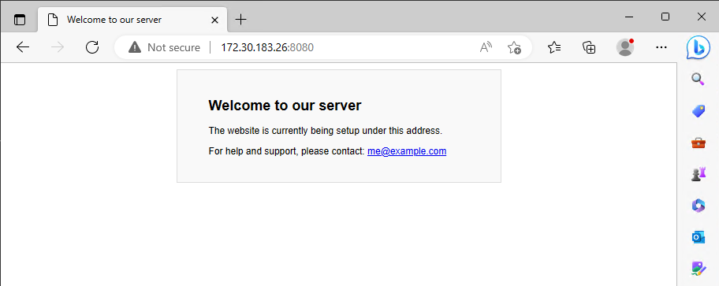
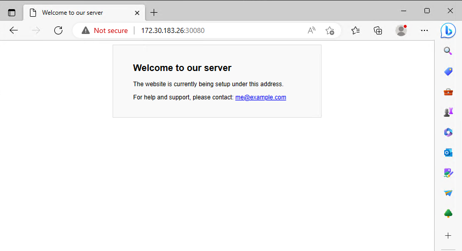

# MicroK8s: Accessing Services

## About <a id="about"></a>
This document describes various ways to access services in Kubernetes from outside Kubernetes.  

## Description <a id="description"></a>
There are many ways to make services in **MicroK8s** availiable. We will look at the most common ones, starting at accessing the Kubernetes 
dashboard with the **proxy** on a singlenode MicroK8s installation, via **Ingress** and end up with a MicroK8s HA cluster that runs **MetalLB** 
as the frontend load balancer.  

## Table of contents <a id="table-of-contents"></a>
1. [About](#about)
2. [Description](#description)
3. [Table of contents](#table-of-contents)
4. [Create the test environment](#create-the-test-environment)
5. [Accessing the Kubernetes dashboard with Proxy](#proxy)
6. [Accessing a service with port-forward](#accessing-a-service-with-port-forward)
7. [Accessing a service with NodePort](#accessing-a-service-with-nodeport)
8. [Related links](#related-links)

## Create the test environment <a id="create-the-test-environment"></a>
Create a Multipass VM called **accessdemo-master** and run the cloud-init script to configure it:
```console
wget https://raw.githubusercontent.com/BeeLazy/Cookbook/main/cloud/cloud-init/MicroK8s.yaml

multipass launch --cloud-init MicroK8s.yaml \
--timeout 1200 \
--name accessdemo-master \
--memory 12G \
--cpus 6 \
--disk 50G
```

SSH into the VM and check that everything is OK:
```console
bee@multipassus:~$ multipass shell accessdemo-master
Welcome to Ubuntu 22.04.2 LTS (GNU/Linux 5.15.0-71-generic x86_64)

ubuntu@accessdemo-master:~$ microk8s status
microk8s is running
high-availability: no
  datastore master nodes: 127.0.0.1:19001
  datastore standby nodes: none
addons:
  enabled:
    dns                  # (core) CoreDNS
    ha-cluster           # (core) Configure high availability on the current node
    helm                 # (core) Helm - the package manager for Kubernetes
    helm3                # (core) Helm 3 - the package manager for Kubernetes
    hostpath-storage     # (core) Storage class; allocates storage from host directory
    storage              # (core) Alias to hostpath-storage add-on, deprecated
  disabled:
    cert-manager         # (core) Cloud native certificate management
    community            # (core) The community addons repository
    dashboard            # (core) The Kubernetes dashboard
    gpu                  # (core) Automatic enablement of Nvidia CUDA
    host-access          # (core) Allow Pods connecting to Host services smoothly
    ingress              # (core) Ingress controller for external access
    kube-ovn             # (core) An advanced network fabric for Kubernetes
    mayastor             # (core) OpenEBS MayaStor
    metallb              # (core) Loadbalancer for your Kubernetes cluster
    metrics-server       # (core) K8s Metrics Server for API access to service metrics
    minio                # (core) MinIO object storage
    observability        # (core) A lightweight observability stack for logs, traces and metrics
    prometheus           # (core) Prometheus operator for monitoring and logging
    rbac                 # (core) Role-Based Access Control for authorisation
    registry             # (core) Private image registry exposed on localhost:32000
```

## Accessing the Kubernetes dashboard with Proxy <a id="accessing-the-kubernetes-dashboard-with-proxy"></a>
Says it's running, but let's install the dashboard and check if everything actually is working.  
```console
ubuntu@accessdemo-master:~$ microk8s enable dashboard
Infer repository core for addon dashboard
Enabling Kubernetes Dashboard
Infer repository core for addon metrics-server
Enabling Metrics-Server
serviceaccount/metrics-server created
clusterrole.rbac.authorization.k8s.io/system:aggregated-metrics-reader created
clusterrole.rbac.authorization.k8s.io/system:metrics-server created
rolebinding.rbac.authorization.k8s.io/metrics-server-auth-reader created
clusterrolebinding.rbac.authorization.k8s.io/metrics-server:system:auth-delegator created
clusterrolebinding.rbac.authorization.k8s.io/system:metrics-server created
service/metrics-server created
deployment.apps/metrics-server created
apiservice.apiregistration.k8s.io/v1beta1.metrics.k8s.io created
clusterrolebinding.rbac.authorization.k8s.io/microk8s-admin created
Metrics-Server is enabled
Applying manifest
serviceaccount/kubernetes-dashboard created
service/kubernetes-dashboard created
secret/kubernetes-dashboard-certs created
secret/kubernetes-dashboard-csrf created
secret/kubernetes-dashboard-key-holder created
configmap/kubernetes-dashboard-settings created
role.rbac.authorization.k8s.io/kubernetes-dashboard created
clusterrole.rbac.authorization.k8s.io/kubernetes-dashboard created
rolebinding.rbac.authorization.k8s.io/kubernetes-dashboard created
clusterrolebinding.rbac.authorization.k8s.io/kubernetes-dashboard created
deployment.apps/kubernetes-dashboard created
service/dashboard-metrics-scraper created
deployment.apps/dashboard-metrics-scraper created
secret/microk8s-dashboard-token created

If RBAC is not enabled access the dashboard using the token retrieved with:

microk8s kubectl describe secret -n kube-system microk8s-dashboard-token

Use this token in the https login UI of the kubernetes-dashboard service.

In an RBAC enabled setup (microk8s enable RBAC) you need to create a user with restricted
permissions as shown in:
https://github.com/kubernetes/dashboard/blob/master/docs/user/access-control/creating-sample-user.md
```

> :warning: **Note:** **RBAC** is out of scope of this article. 

To access the dashboard we can use the **microk8s dashboard-proxy** command. That will make the Dashboard accessible on **localhost**
```console
ubuntu@accessdemo-master:~$ microk8s dashboard-proxy
Checking if Dashboard is running.
Infer repository core for addon dashboard
Waiting for Dashboard to come up.
Trying to get token from microk8s-dashboard-token
Waiting for secret token (attempt 0)
Dashboard will be available at https://127.0.0.1:10443
Use the following token to login:
eyJhbGciOiJSUzI1NiIs....
```

The dashboard is now availiable on the **Multipass VM** on **https://127.0.0.1:10443**
```console
ubuntu@accessdemo-master:~$ curl https://127.0.0.1:10443
curl: (60) SSL certificate problem: self-signed certificate
More details here: https://curl.se/docs/sslcerts.html

curl failed to verify the legitimacy of the server and therefore could not
establish a secure connection to it. To learn more about this situation and
how to fix it, please visit the web page mentioned above.
```

And to the **Multipass host** on **https://IPofMultipassVM:10443**:
```console
PS C:\Users\bee> multipass list
Name                    State             IPv4             Image
accessdemo-master       Running           172.30.183.26    Ubuntu 22.04 LTS
                                          10.1.183.64
```

In a browser:


Use the token we got when starting the proxy to login. In a later guide we will setup role based authentication. 


## Accessing a service with port-forward <a id="accessing-a-service-with-port-forward"></a>
Having access to the dashboard is good, but this will not help us with all the other services we plan to run in our Kubernetes.  

Kubectl have a command called **port-forward** that will help us with this. It will forward a port from any service to the host.  

Let us deploy a Nginx webserver to see how it works. In this config we have a nginx webserver listening to **port 80 in the container** 

Create **nginx-portforward.yaml**
```yaml
apiVersion: v1
kind: Pod
metadata:
  name: my-nginx
  labels:
    app: nginx
spec:
  containers:
    - name: nginx
      image: linuxserver/nginx
      ports:
        - containerPort: 80
          name: nginx-http
---
apiVersion: v1
kind: Service
metadata:
  name: my-nginx
spec:
  ports:
  - name: http
    port: 80
    protocol: TCP
    targetPort: nginx-http
  selector:
    app: nginx
```

Or download it:
```console
ubuntu@accessdemo-master:~$ wget https://raw.githubusercontent.com/BeeLazy/Cookbook/main/cloud/examples/microk8s-accessingservices/nginx-portforward.yaml
2023-05-11 18:36:38 (12.7 MB/s) - 'nginx-portforward.yaml' saved [352/352]
```

Apply the pod:
```console
ubuntu@accessdemo-master:~$ kubectl apply -f nginx-portforward.yaml
pod/my-nginx created
service/my-nginx created
```

Check that everything went ok:
```console
ubuntu@accessdemo-master:~$ kubectl get pods -o wide
NAME       READY   STATUS    RESTARTS   AGE   IP            NODE                NOMINATED NODE   READINESS GATES
my-nginx   1/1     Running   0          4s    10.1.183.77   accessdemo-master   <none>           <none>

ubuntu@accessdemo-master:~$ kubectl get service
NAME         TYPE        CLUSTER-IP      EXTERNAL-IP   PORT(S)   AGE
kubernetes   ClusterIP   10.152.183.1    <none>        443/TCP   21h
my-nginx     ClusterIP   10.152.183.47   <none>        80/TCP    21s
```

The Nginx webserver is currently only available on the Kubernetes cluster network on port 80. To be able to connect to it, we will have to make the port available 
outside Kubernetes. One way to do that is to forward the port with **kubectl port-forward**. Here we forward it to **port 8080** on the host:
```console
microk8s.kubectl port-forward --address 0.0.0.0 svc/my-nginx -n default 8080:80
```

We can now access the webserver from the **Multipass VM at http://localhost:8080**:
```console
ubuntu@accessdemo-master:~$ curl http://localhost:8080
    <html>
        <head>
            <title>Welcome to our server</title>
            <style>
<snipp>
```

And from the **Multipass Host at http://IPofMultipassVM:8080**:



## Accessing a service with NodePort <a id="accessing-a-service-with-nodeport"></a>
**kubectl port-forward** is a practical tool to open a port now and then for various reasons, but it requires the console to stay open and it quickly becomes a headache 
if you try to manage all the ports that way.  

A more permanent solution to this is **NodePort** which allow us to define the port in the service. Let us edit our Nginx deployment, to see how NodePort works.  

In this config we have the nginx webserver listening to **port 80 in the container** 
and we have a **NodePort** service that will forward it to **port 30080 on the host**. NodePort uses a range of 30000-32767.  

Create **nginx-nodeport.yaml**
```yaml
apiVersion: v1
kind: Pod
metadata:
  name: my-nginx
  labels:
    app: nginx
spec:
  containers:
    - name: nginx
      image: linuxserver/nginx
      ports:
        - containerPort: 80
          name: nginx-http
---
apiVersion: v1
kind: Service
metadata:
  name: my-nginx
spec:
  type: NodePort
  ports:
    - name: http
      port: 80
      nodePort: 30080
      targetPort: nginx-http
  selector:
    app: nginx
```

Or download it:
```console
ubuntu@accessdemo-master:~$ wget https://raw.githubusercontent.com/BeeLazy/Cookbook/main/cloud/examples/microk8s-accessingservices/nginx-nodeport.yaml
2023-05-11 18:07:42 (20.9 MB/s) - 'nginx-nodeport.yaml' saved [418/418]
```

Apply it to reconfigure our Nginx deployment:
```console
ubuntu@accessdemo-master:~$ kubectl apply -f nginx-nodeport.yaml
pod/my-nginx unchanged
service/my-nginx configured
```

Check that everything went ok:
```console
ubuntu@accessdemo-master:~$ kubectl get pods -o wide
NAME       READY   STATUS    RESTARTS   AGE   IP            NODE                NOMINATED NODE   READINESS GATES
my-nginx   1/1     Running   0          30m   10.1.183.77   accessdemo-master   <none>           <none>

ubuntu@accessdemo-master:~$ kubectl get service
NAME         TYPE        CLUSTER-IP      EXTERNAL-IP   PORT(S)        AGE
kubernetes   ClusterIP   10.152.183.1    <none>        443/TCP        22h
my-nginx     NodePort    10.152.183.47   <none>        80:30080/TCP   30m
```

We can now access the webserver from the **Multipass VM at http://localhost:30080**:
```console
ubuntu@accessdemo-master:~$ curl http://localhost:30080
    <html>
        <head>
            <title>Welcome to our server</title>
            <style>
<snipp>
```

And from the **Multipass Host at http://IPofMultipassVM:30080**:



## Related links <a id="related-links"></a>
[Kubernetes basic operations - ubuntu.com](https://ubuntu.com/kubernetes/docs/operations)  
