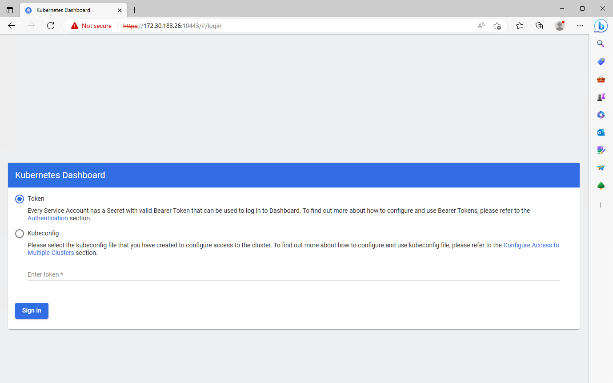
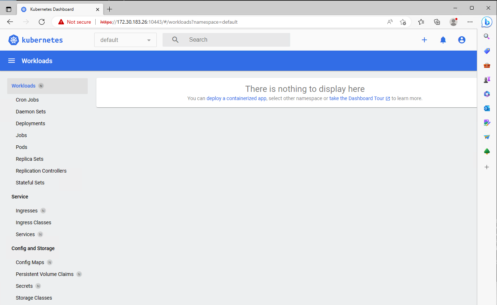

# MicroK8s: Accessing Services

## About <a id="about"></a>
This document describes various ways to access services in Kubernetes from outside Kubernetes.  

## Description <a id="description"></a>
There are many ways to make services in **MicroK8s** availiable. We will look at the most common ones, starting at accessing the Kubernetes 
dashboard with the **proxy** on a singlenode MicroK8s installation, via **Ingress** and end up with a MicroK8s HA cluster that runs **MetalLB** 
as the frontend load balancer.  

## Table of contents <a id="table-of-contents"></a>
1. [About](#about)
2. [Description](#description)
3. [Table of contents](#table-of-contents)
5. [Create the test environment](#create-the-test-environment)
9. [Accessing the Kubernetes dashboard with Proxy](#proxy)
9. [Related links](#related-links)

## Create the test environment <a id="create-the-test-environment"></a>
Create a Multipass VM called **accessdemo-master** and run the cloud-init script to configure it:
```console
wget https://raw.githubusercontent.com/BeeLazy/Cookbook/main/cloud/cloud-init/MicroK8s.yaml

multipass launch --cloud-init MicroK8s.yaml \
--timeout 1200 \
--name accessdemo-master \
--memory 12G \
--cpus 6 \
--disk 50G
```

SSH into the VM and check that everything is OK:
```console
bee@multipassus:~$ multipass shell accessdemo-master
Welcome to Ubuntu 22.04.2 LTS (GNU/Linux 5.15.0-71-generic x86_64)

ubuntu@accessdemo-master:~$ microk8s status
microk8s is running
high-availability: no
  datastore master nodes: 127.0.0.1:19001
  datastore standby nodes: none
addons:
  enabled:
    dns                  # (core) CoreDNS
    ha-cluster           # (core) Configure high availability on the current node
    helm                 # (core) Helm - the package manager for Kubernetes
    helm3                # (core) Helm 3 - the package manager for Kubernetes
    hostpath-storage     # (core) Storage class; allocates storage from host directory
    storage              # (core) Alias to hostpath-storage add-on, deprecated
  disabled:
    cert-manager         # (core) Cloud native certificate management
    community            # (core) The community addons repository
    dashboard            # (core) The Kubernetes dashboard
    gpu                  # (core) Automatic enablement of Nvidia CUDA
    host-access          # (core) Allow Pods connecting to Host services smoothly
    ingress              # (core) Ingress controller for external access
    kube-ovn             # (core) An advanced network fabric for Kubernetes
    mayastor             # (core) OpenEBS MayaStor
    metallb              # (core) Loadbalancer for your Kubernetes cluster
    metrics-server       # (core) K8s Metrics Server for API access to service metrics
    minio                # (core) MinIO object storage
    observability        # (core) A lightweight observability stack for logs, traces and metrics
    prometheus           # (core) Prometheus operator for monitoring and logging
    rbac                 # (core) Role-Based Access Control for authorisation
    registry             # (core) Private image registry exposed on localhost:32000
```

## Accessing the Kubernetes dashboard with Proxy <a id="accessing-the-kubernetes-dashboard-with-proxy"></a>
Says it's running, but let's install the dashboard and check if everything actually is working.  
```console
ubuntu@accessdemo-master:~$ microk8s enable dashboard
Infer repository core for addon dashboard
Enabling Kubernetes Dashboard
Infer repository core for addon metrics-server
Enabling Metrics-Server
serviceaccount/metrics-server created
clusterrole.rbac.authorization.k8s.io/system:aggregated-metrics-reader created
clusterrole.rbac.authorization.k8s.io/system:metrics-server created
rolebinding.rbac.authorization.k8s.io/metrics-server-auth-reader created
clusterrolebinding.rbac.authorization.k8s.io/metrics-server:system:auth-delegator created
clusterrolebinding.rbac.authorization.k8s.io/system:metrics-server created
service/metrics-server created
deployment.apps/metrics-server created
apiservice.apiregistration.k8s.io/v1beta1.metrics.k8s.io created
clusterrolebinding.rbac.authorization.k8s.io/microk8s-admin created
Metrics-Server is enabled
Applying manifest
serviceaccount/kubernetes-dashboard created
service/kubernetes-dashboard created
secret/kubernetes-dashboard-certs created
secret/kubernetes-dashboard-csrf created
secret/kubernetes-dashboard-key-holder created
configmap/kubernetes-dashboard-settings created
role.rbac.authorization.k8s.io/kubernetes-dashboard created
clusterrole.rbac.authorization.k8s.io/kubernetes-dashboard created
rolebinding.rbac.authorization.k8s.io/kubernetes-dashboard created
clusterrolebinding.rbac.authorization.k8s.io/kubernetes-dashboard created
deployment.apps/kubernetes-dashboard created
service/dashboard-metrics-scraper created
deployment.apps/dashboard-metrics-scraper created
secret/microk8s-dashboard-token created

If RBAC is not enabled access the dashboard using the token retrieved with:

microk8s kubectl describe secret -n kube-system microk8s-dashboard-token

Use this token in the https login UI of the kubernetes-dashboard service.

In an RBAC enabled setup (microk8s enable RBAC) you need to create a user with restricted
permissions as shown in:
https://github.com/kubernetes/dashboard/blob/master/docs/user/access-control/creating-sample-user.md
```

> :warning: **Note:** **RBAC** is out of scope of this article. 

To access the dashboard we can use the **microk8s dashboard-proxy** command. That will make the Dashboard accessible on **localhost**
```console
ubuntu@accessdemo-master:~$ microk8s dashboard-proxy
Checking if Dashboard is running.
Infer repository core for addon dashboard
Waiting for Dashboard to come up.
Trying to get token from microk8s-dashboard-token
Waiting for secret token (attempt 0)
Dashboard will be available at https://127.0.0.1:10443
Use the following token to login:
eyJhbGciOiJSUzI1NiIs....
```

The dashboard is now availiable on the **Multipass VM** on **https://127.0.0.1:10443**
```console
ubuntu@accessdemo-master:~$ curl https://127.0.0.1:10443
curl: (60) SSL certificate problem: self-signed certificate
More details here: https://curl.se/docs/sslcerts.html

curl failed to verify the legitimacy of the server and therefore could not
establish a secure connection to it. To learn more about this situation and
how to fix it, please visit the web page mentioned above.
```

And to the **Multipass host** on **https://IPofMultipassVM:10443**:
```console
PS C:\Users\bee> multipass list
Name                    State             IPv4             Image
accessdemo-master       Running           172.30.183.26    Ubuntu 22.04 LTS
                                          10.1.183.64
```

In a browser:


Use the token we got when starting the proxy to login. In a later guide we will setup role based authentication. 



## Related links <a id="related-links"></a>
[Kubernetes basic operations - ubuntu.com](https://ubuntu.com/kubernetes/docs/operations)  
