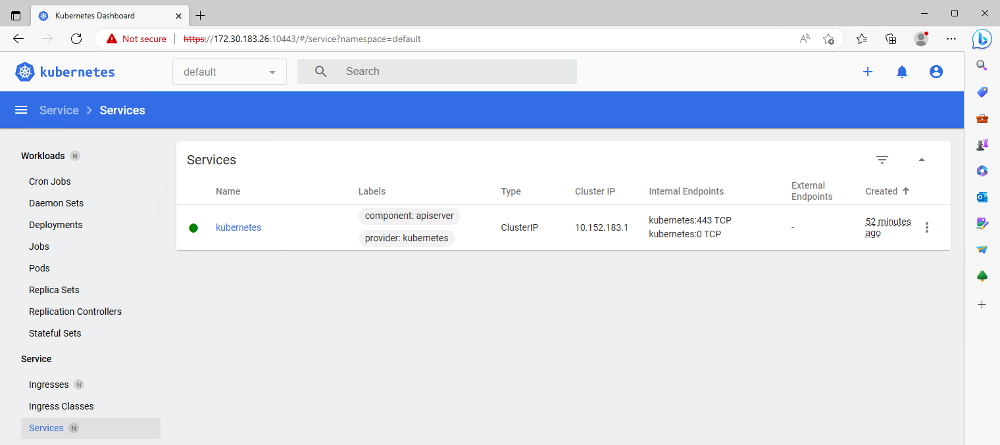

# MicroK8s: Accessing Services

## About <a id="about"></a>
This document describes various ways to access services in Kubernetes from outside Kubernetes.  

## Description <a id="description"></a>
There are many ways to make services in **MicroK8s** availiable. We will look at the most common ones, starting at accessing the Kubernetes 
dashboard with the **proxy** on a singlenode MicroK8s installation, via **Ingress** and end up with a MicroK8s HA cluster that runs **MetalLB** 
as the frontend load balancer.  

## Table of contents <a id="table-of-contents"></a>
1. [About](#about)
2. [Description](#description)
3. [Table of contents](#table-of-contents)
4. [Create the test environment](#create-the-test-environment)
5. [Accessing the Kubernetes dashboard with Proxy](#proxy)
6. [Accessing a service with port-forward](#accessing-a-service-with-port-forward)
7. [Accessing a service with NodePort](#accessing-a-service-with-nodeport)
8. [Accessing a service with Ingress](#accessing-a-service-with-ingress)
9. [Accessing a clustered service with MetalLB](#accessing-a-clustered-service-with-metallb)
10. [Related links](#related-links)

## Create the test environment <a id="create-the-test-environment"></a>
Create a Multipass VM called **accessdemo-master** and run the cloud-init script to configure it:
```console
wget https://raw.githubusercontent.com/BeeLazy/Cookbook/main/cloud/cloud-init/MicroK8s.yaml

multipass launch --cloud-init MicroK8s.yaml \
--timeout 1200 \
--name accessdemo-master \
--memory 12G \
--cpus 6 \
--disk 50G
```

SSH into the VM and check that everything is OK:
```console
bee@multipassus:~$ multipass shell accessdemo-master
Welcome to Ubuntu 22.04.2 LTS (GNU/Linux 5.15.0-71-generic x86_64)

ubuntu@accessdemo-master:~$ microk8s status
microk8s is running
high-availability: no
  datastore master nodes: 127.0.0.1:19001
  datastore standby nodes: none
addons:
  enabled:
    dns                  # (core) CoreDNS
    ha-cluster           # (core) Configure high availability on the current node
    helm                 # (core) Helm - the package manager for Kubernetes
    helm3                # (core) Helm 3 - the package manager for Kubernetes
    hostpath-storage     # (core) Storage class; allocates storage from host directory
    storage              # (core) Alias to hostpath-storage add-on, deprecated
  disabled:
    cert-manager         # (core) Cloud native certificate management
    community            # (core) The community addons repository
    dashboard            # (core) The Kubernetes dashboard
    gpu                  # (core) Automatic enablement of Nvidia CUDA
    host-access          # (core) Allow Pods connecting to Host services smoothly
    ingress              # (core) Ingress controller for external access
    kube-ovn             # (core) An advanced network fabric for Kubernetes
    mayastor             # (core) OpenEBS MayaStor
    metallb              # (core) Loadbalancer for your Kubernetes cluster
    metrics-server       # (core) K8s Metrics Server for API access to service metrics
    minio                # (core) MinIO object storage
    observability        # (core) A lightweight observability stack for logs, traces and metrics
    prometheus           # (core) Prometheus operator for monitoring and logging
    rbac                 # (core) Role-Based Access Control for authorisation
    registry             # (core) Private image registry exposed on localhost:32000
```

## Accessing the Kubernetes dashboard with Proxy <a id="accessing-the-kubernetes-dashboard-with-proxy"></a>
Says it's running, but let's install the dashboard and check if everything actually is working.  
```console
ubuntu@accessdemo-master:~$ microk8s enable dashboard
Infer repository core for addon dashboard
Enabling Kubernetes Dashboard
Infer repository core for addon metrics-server
Enabling Metrics-Server
serviceaccount/metrics-server created
clusterrole.rbac.authorization.k8s.io/system:aggregated-metrics-reader created
clusterrole.rbac.authorization.k8s.io/system:metrics-server created
rolebinding.rbac.authorization.k8s.io/metrics-server-auth-reader created
clusterrolebinding.rbac.authorization.k8s.io/metrics-server:system:auth-delegator created
clusterrolebinding.rbac.authorization.k8s.io/system:metrics-server created
service/metrics-server created
deployment.apps/metrics-server created
apiservice.apiregistration.k8s.io/v1beta1.metrics.k8s.io created
clusterrolebinding.rbac.authorization.k8s.io/microk8s-admin created
Metrics-Server is enabled
Applying manifest
serviceaccount/kubernetes-dashboard created
service/kubernetes-dashboard created
secret/kubernetes-dashboard-certs created
secret/kubernetes-dashboard-csrf created
secret/kubernetes-dashboard-key-holder created
configmap/kubernetes-dashboard-settings created
role.rbac.authorization.k8s.io/kubernetes-dashboard created
clusterrole.rbac.authorization.k8s.io/kubernetes-dashboard created
rolebinding.rbac.authorization.k8s.io/kubernetes-dashboard created
clusterrolebinding.rbac.authorization.k8s.io/kubernetes-dashboard created
deployment.apps/kubernetes-dashboard created
service/dashboard-metrics-scraper created
deployment.apps/dashboard-metrics-scraper created
secret/microk8s-dashboard-token created

If RBAC is not enabled access the dashboard using the token retrieved with:

microk8s kubectl describe secret -n kube-system microk8s-dashboard-token

Use this token in the https login UI of the kubernetes-dashboard service.

In an RBAC enabled setup (microk8s enable RBAC) you need to create a user with restricted
permissions as shown in:
https://github.com/kubernetes/dashboard/blob/master/docs/user/access-control/creating-sample-user.md
```

> :warning: **Note:** **RBAC** is out of scope of this article. 

To access the dashboard we can use the **microk8s dashboard-proxy** command. That will make the Dashboard accessible on **localhost**
```console
ubuntu@accessdemo-master:~$ microk8s dashboard-proxy
Checking if Dashboard is running.
Infer repository core for addon dashboard
Waiting for Dashboard to come up.
Trying to get token from microk8s-dashboard-token
Waiting for secret token (attempt 0)
Dashboard will be available at https://127.0.0.1:10443
Use the following token to login:
eyJhbGciOiJSUzI1NiIs....
```

The dashboard is now availiable on the **Multipass VM** on **https://127.0.0.1:10443**
```console
ubuntu@accessdemo-master:~$ curl https://127.0.0.1:10443
curl: (60) SSL certificate problem: self-signed certificate
More details here: https://curl.se/docs/sslcerts.html

curl failed to verify the legitimacy of the server and therefore could not
establish a secure connection to it. To learn more about this situation and
how to fix it, please visit the web page mentioned above.
```

And to the **Multipass host** on **https://IPofMultipassVM:10443**:
```console
PS C:\Users\bee> multipass list
Name                    State             IPv4             Image
accessdemo-master       Running           172.30.183.26    Ubuntu 22.04 LTS
                                          10.1.183.64
```

In a browser:


Use the token we got when starting the proxy to login. In a later guide we will setup role based authentication. 



## Accessing a service with port-forward <a id="accessing-a-service-with-port-forward"></a>
Having access to the dashboard is good, but this will not help us with all the other services we plan to run in our Kubernetes.  

Kubectl have a command called **port-forward** that will help us with this. It will forward a port from any service to the host.  

Let us deploy a Nginx webserver to see how it works. In this config we have a nginx webserver listening to **port 80 in the container** 

Create **nginx-portforward.yaml**
```yaml
apiVersion: v1
kind: Pod
metadata:
  name: my-nginx
  labels:
    app: nginx
spec:
  containers:
    - name: nginx
      image: linuxserver/nginx
      ports:
        - containerPort: 80
          name: nginx-http
---
apiVersion: v1
kind: Service
metadata:
  name: my-nginx
spec:
  ports:
  - name: http
    port: 80
    protocol: TCP
    targetPort: nginx-http
  selector:
    app: nginx
```

Or download it:
```console
ubuntu@accessdemo-master:~$ wget https://raw.githubusercontent.com/BeeLazy/Cookbook/main/cloud/examples/microk8s-accessingservices/nginx-portforward.yaml
2023-05-11 18:36:38 (12.7 MB/s) - 'nginx-portforward.yaml' saved [352/352]
```

Apply the pod:
```console
ubuntu@accessdemo-master:~$ kubectl apply -f nginx-portforward.yaml
pod/my-nginx created
service/my-nginx created
```

Check that everything went ok:
```console
ubuntu@accessdemo-master:~$ kubectl get pods -o wide
NAME       READY   STATUS    RESTARTS   AGE   IP            NODE                NOMINATED NODE   READINESS GATES
my-nginx   1/1     Running   0          4s    10.1.183.77   accessdemo-master   <none>           <none>

ubuntu@accessdemo-master:~$ kubectl get service
NAME         TYPE        CLUSTER-IP      EXTERNAL-IP   PORT(S)   AGE
kubernetes   ClusterIP   10.152.183.1    <none>        443/TCP   21h
my-nginx     ClusterIP   10.152.183.47   <none>        80/TCP    21s
```

The Nginx webserver is currently only available on the Kubernetes cluster network on port 80. To be able to connect to it, we will have to make the port available 
outside Kubernetes. One way to do that is to forward the port with **kubectl port-forward**. Here we forward it to **port 8080** on the host:
```console
microk8s.kubectl port-forward --address 0.0.0.0 svc/my-nginx -n default 8080:80
```

We can now access the webserver from the **Multipass VM at http://localhost:8080**:
```console
ubuntu@accessdemo-master:~$ curl http://localhost:8080
    <html>
        <head>
            <title>Welcome to our server</title>
            <style>
<snipp>
```

And from the **Multipass Host at http://IPofMultipassVM:8080**:


## Accessing a service with NodePort <a id="accessing-a-service-with-nodeport"></a>
**kubectl port-forward** is a practical tool to open a port now and then for various reasons, but it requires the console to stay open and it quickly becomes a headache 
if you try to manage all the ports that way.  

A more permanent solution to this is **NodePort** which allow us to define the port in the service. Let us edit our Nginx deployment, to see how NodePort works.  

In this config we have the nginx webserver listening to **port 80 in the container** 
and we have a **NodePort** service that will forward it to **port 30080 on the host**. NodePort uses a range of 30000-32767.  

Create **nginx-nodeport.yaml**
```yaml
apiVersion: v1
kind: Pod
metadata:
  name: my-nginx
  labels:
    app: nginx
spec:
  containers:
    - name: nginx
      image: linuxserver/nginx
      ports:
        - containerPort: 80
          name: nginx-http
---
apiVersion: v1
kind: Service
metadata:
  name: my-nginx
spec:
  type: NodePort
  ports:
    - name: http
      port: 80
      nodePort: 30080
      targetPort: nginx-http
  selector:
    app: nginx
```

Or download it:
```console
ubuntu@accessdemo-master:~$ wget https://raw.githubusercontent.com/BeeLazy/Cookbook/main/cloud/examples/microk8s-accessingservices/nginx-nodeport.yaml
2023-05-11 18:07:42 (20.9 MB/s) - 'nginx-nodeport.yaml' saved [418/418]
```

Apply it to reconfigure our Nginx deployment:
```console
ubuntu@accessdemo-master:~$ kubectl apply -f nginx-nodeport.yaml
pod/my-nginx unchanged
service/my-nginx configured
```

Check that everything went ok:
```console
ubuntu@accessdemo-master:~$ kubectl get pods -o wide
NAME       READY   STATUS    RESTARTS   AGE   IP            NODE                NOMINATED NODE   READINESS GATES
my-nginx   1/1     Running   0          30m   10.1.183.77   accessdemo-master   <none>           <none>

ubuntu@accessdemo-master:~$ kubectl get service
NAME         TYPE        CLUSTER-IP      EXTERNAL-IP   PORT(S)        AGE
kubernetes   ClusterIP   10.152.183.1    <none>        443/TCP        22h
my-nginx     NodePort    10.152.183.47   <none>        80:30080/TCP   30m
```

We can now access the webserver from the **Multipass VM at http://localhost:30080**:
```console
ubuntu@accessdemo-master:~$ curl http://localhost:30080
    <html>
        <head>
            <title>Welcome to our server</title>
            <style>
<snipp>
```

And from the **Multipass Host at http://IPofMultipassVM:30080**:


## Accessing a service with Ingress <a id="accessing-a-service-with-ingress"></a>
**NodePort** is a good tool for many things, but just like **port-forward** it suffers under the fact that it's limited to low layers. 
Let's say you want to serve more than one websites on port 80 from the same host. That's going to be a problem. 

**Ingress** can help us with that. In Ingress we can create rules that define what service to route the different incoming calls to. 

Start with enabling Ingress:
```console
ubuntu@accessdemo-master:~$ microk8s enable ingress
Infer repository core for addon ingress
Enabling Ingress
ingressclass.networking.k8s.io/public created
ingressclass.networking.k8s.io/nginx created
namespace/ingress created
serviceaccount/nginx-ingress-microk8s-serviceaccount created
clusterrole.rbac.authorization.k8s.io/nginx-ingress-microk8s-clusterrole created
role.rbac.authorization.k8s.io/nginx-ingress-microk8s-role created
clusterrolebinding.rbac.authorization.k8s.io/nginx-ingress-microk8s created
rolebinding.rbac.authorization.k8s.io/nginx-ingress-microk8s created
configmap/nginx-load-balancer-microk8s-conf created
configmap/nginx-ingress-tcp-microk8s-conf created
configmap/nginx-ingress-udp-microk8s-conf created
daemonset.apps/nginx-ingress-microk8s-controller created
Ingress is enabled
```

Check that everything is OK
```console
ubuntu@accessdemo-master:~$ microk8s kubectl get pods -n ingress
NAME                                      READY   STATUS    RESTARTS   AGE
nginx-ingress-microk8s-controller-44dtp   1/1     Running   0          24s
```

Now we need to create a Ingress routing rule, so that when there is traffic incoming (on **my-nginx.pretenddomain.com** in this example), 
it get's routed to our nginx webservice. 

Contents of **nginx-ingress.yaml**
```yaml
apiVersion: networking.k8s.io/v1
kind: Ingress
metadata:
  name: my-ingress
  annotations:
    nginx.ingress.kubernetes.io/rewrite-target: /
spec:
  ingressClassName: nginx
  rules:
  - host: my-nginx.pretenddomain.com
    http:
      paths:
      - path: /
        pathType: Prefix
        backend:
          service:
            name: my-nginx
            port:
              number: 80
```

Create the Ingress rule in Kubernetes
```console
ubuntu@accessdemo-master:~$ wget https://raw.githubusercontent.com/BeeLazy/Cookbook/main/cloud/examples/microk8s-accessingservices/nginx-ingress.yaml
ubuntu@accessdemo-master:~$ microk8s kubectl create -f nginx-ingress.yaml
ingress.networking.k8s.io/my-ingress created
```

Check the status of it:
```console
ubuntu@accessdemo-master:~$ microk8s kubectl get ingress
NAME         CLASS   HOSTS                        ADDRESS     PORTS   AGE
my-ingress   nginx   my-nginx.pretenddomain.com   127.0.0.1   80      114s
```

Add a DNS record the service. Since I don't even own the pretenddomain.com I had to add it to my **hosts** instead:
```console
sudo nano /etc/hosts
```

If we try with the IP, we will see that nginx ingress is replying, but **404 Not Found** because there is no ruting rules on the IP.
```console
ubuntu@accessdemo-master:~$ curl http://172.25.232.133
<html>
<head><title>404 Not Found</title></head>
<body>
<center><h1>404 Not Found</h1></center>
<hr><center>nginx</center>
</body>
</html>
```

If we try with the hostname we added to **hosts** (or dns record if you have working dns), we will see that we get routed to the correct place:
```console
ubuntu@accessdemo-master:~$ curl http://my-nginx.pretenddomain.com
    <html>
        <head>
            <title>Welcome to our server</title>
            <style>
```

Powershell on another computer in the network:
```powershell
PS C:\Users\bee> curl http://my-nginx.pretenddomain.com
StatusCode        : 200
StatusDescription : OK
```

To build further on the routing, we will deploy two echo apps.  

Contents of **echo-queen.yaml**
```yaml
kind: Pod
apiVersion: v1
metadata:
  name: my-queen
  labels:
    app: queen
spec:
  containers:
    - name: queen-app
      image: hashicorp/http-echo
      args:
        - "-text=queen"
---
kind: Service
apiVersion: v1
metadata:
  name: my-queen
spec:
  selector:
    app: queen
  ports:
    - port: 5678
```

Contents of **echo-hive.yaml**
```yaml
kind: Pod
apiVersion: v1
metadata:
  name: my-hive
  labels:
    app: hive
spec:
  containers:
    - name: hive-app
      image: hashicorp/http-echo
      args:
        - "-text=hive"
---
kind: Service
apiVersion: v1
metadata:
  name: my-hive
spec:
  selector:
    app: hive
  ports:
    - port: 5678
```

Apply the services:
```console
ubuntu@accessdemo-master:~$ wget https://raw.githubusercontent.com/BeeLazy/Cookbook/main/cloud/examples/microk8s-accessingservices/echo-queen.yaml
ubuntu@accessdemo-master:~$ wget https://raw.githubusercontent.com/BeeLazy/Cookbook/main/cloud/examples/microk8s-accessingservices/echo-hive.yaml

ubuntu@accessdemo-master:~$ kubectl apply -f echo-queen.yaml
pod/my-queen created
service/my-queen created

ubuntu@accessdemo-master:~$ kubectl apply -f echo-hive.yaml
pod/my-hive created
service/my-hive created
```

Then change the Ingress routing to account for the two new services.  

Contents of **nginx-echo-ingress.yaml**
```yaml
apiVersion: networking.k8s.io/v1
kind: Ingress
metadata:
  name: my-ingress
  annotations:
    nginx.ingress.kubernetes.io/rewrite-target: /
spec:
  ingressClassName: nginx
  rules:
  - host: my-nginx.pretenddomain.com
    http:
      paths:
      - path: /
        pathType: Prefix
        backend:
          service:
            name: my-nginx
            port:
              number: 80
      - path: /queen
        pathType: Prefix
        backend:
          service:
            name: my-queen
            port:
              number: 5678
      - path: /hive
        pathType: Prefix
        backend:
          service:
            name: my-hive
            port:
              number: 5678
```

Remove the old Ingress routing, and apply the new we just created:
```console
ubuntu@accessdemo-master:~$ wget https://raw.githubusercontent.com/BeeLazy/Cookbook/main/cloud/examples/microk8s-accessingservices/nginx-echo-ingress.yaml

ubuntu@accessdemo-master:~$ microk8s kubectl delete -f nginx-ingress.yaml
ingress.networking.k8s.io "my-ingress" deleted

ubuntu@accessdemo-master:~$ microk8s kubectl create -f nginx-echo-ingress.yaml
ingress.networking.k8s.io/my-ingress created
```

Now we can use the new **/hive** and **/queen** routing too:
```console
ubuntu@accessdemo-master:~$ curl http://my-nginx.pretenddomain.com/queen
queen

ubuntu@accessdemo-master:~$ curl http://my-nginx.pretenddomain.com/hive
hive

ubuntu@accessdemo-master:~$ curl http://my-nginx.pretenddomain.com/leadsnowhere
    <html>
        <head>
            <title>Welcome to our server</title>
            <style>
```

As we can see, the different rules lead to the different services. And our **/ rule** catching everything that has no route. The 
longest rule that matches wins.  

Ingress can also route **TCP** and **UDP** services, not just **HTTP**. Besides the routing options, another advantage of Ingress 
is that it let's us **consolidate all routing rules** into a single resource.  

This is starting to look like a manageble solution!  

## Accessing a clustered service with MetalLB <a id="accessing-a-clustered-service-with-metallb"></a>
But what happens on a cluster? We only have a master node right now, so we need to add a couple more nodes:

Create two Multipass VMs called **accessdemo-master-2** and **accessdemo-master-3**. Use the cloud-init script we downloaded earlier:
```console
multipass launch --cloud-init MicroK8s.yaml \
--timeout 1200 \
--name accessdemo-master-2 \
--memory 12G \
--cpus 6 \
--disk 50G

multipass launch --cloud-init MicroK8s.yaml \
--timeout 1200 \
--name accessdemo-master-3 \
--memory 12G \
--cpus 6 \
--disk 50G
```

> :warning: **Caution:** If you don't have 3* 12G memory availiable, you will need to adjust the resources

When they are done, we need to join them to the cluster. First generate a join key on the **accessdemo-master** node
```console
ubuntu@accessdemo-master:~$ microk8s add-node
From the node you wish to join to this cluster, run the following:
microk8s join 172.25.232.133:25000/17953b4b86d9af021240c847bea96d85/47b98a18eb80

Use the '--worker' flag to join a node as a worker not running the control plane, eg:
microk8s join 172.25.232.133:25000/17953b4b86d9af021240c847bea96d85/47b98a18eb80 --worker

If the node you are adding is not reachable through the default interface you can use one of the following:
microk8s join 172.25.232.133:25000/17953b4b86d9af021240c847bea96d85/47b98a18eb80
```

Then on **accessdemo-master-2** add it without the **--worker** flag. We will add pure workers in a later guide:
```console
ubuntu@accessdemo-master-2:~$ microk8s join 172.25.232.133:25000/17953b4b86d9af021240c847bea96d85/47b98a18eb80
WARNING: Hostpath storage is enabled and is not suitable for multi node clusters.

Contacting cluster at 172.25.232.133
Waiting for this node to finish joining the cluster. .. .. ..
```

Create another key for **accessdemo-master-3** and then join it:
```console
ubuntu@accessdemo-master:~$ microk8s add-node
From the node you wish to join to this cluster, run the following:
microk8s join 172.25.232.133:25000/da1d61fa4aa71f281ddd7dd960311f08/47b98a18eb80

Use the '--worker' flag to join a node as a worker not running the control plane, eg:
microk8s join 172.25.232.133:25000/da1d61fa4aa71f281ddd7dd960311f08/47b98a18eb80 --worker

If the node you are adding is not reachable through the default interface you can use one of the following:
microk8s join 172.25.232.133:25000/da1d61fa4aa71f281ddd7dd960311f08/47b98a18eb80
```

```console
ubuntu@accessdemo-master-3:~$ microk8s join 172.25.232.133:25000/da1d61fa4aa71f281ddd7dd960311f08/47b98a18eb80
WARNING: Hostpath storage is enabled and is not suitable for multi node clusters.

Contacting cluster at 172.25.232.133
Waiting for this node to finish joining the cluster. .. .. ..
```

With all 3 nodes in the cluster, we're ready to check the status:
```console
ubuntu@accessdemo-master-3:~$ microk8s status
microk8s is running
high-availability: yes
  datastore master nodes: 172.25.232.133:19001 172.25.229.242:19001 172.25.239.237:19001
  datastore standby nodes: none
  
ubuntu@accessdemo-worker-2:~$ microk8s.kubectl get nodes
NAME                  STATUS   ROLES    AGE    VERSION
accessdemo-master     Ready    <none>   28m    v1.27.0
accessdemo-master-2   Ready    <none>   2m7s   v1.27.0
accessdemo-master-3   Ready    <none>   62s    v1.27.0
```

We see that when there are 3 nodes that can run the **control plane**, then high-availability is automatically enabled. 
However that also gives us **1 Ingress controller per node**:
```console
ubuntu@accessdemo-master:~$ microk8s kubectl get pods -n ingress
NAME                                      READY   STATUS    RESTARTS        AGE
nginx-ingress-microk8s-controller-plxs4   1/1     Running   0               27m
nginx-ingress-microk8s-controller-vlhv9   1/1     Running   0               11m
nginx-ingress-microk8s-controller-k2vpl   1/1     Running   1 (9m35s ago)   10m
```

This ruins the fun for our Ingress ruting, since it now has 3 entry points, no load balancing nor any failover for the entrypoints. 
To solve this we need to run a load balancer in front of Ingress. **MetalLB** is one of these load balancers.  

Start with enabling **MetalLB**. Give it a range from the 'external' IP range (that's not used by anything else):
```console
ubuntu@accessdemo-master:~$ microk8s enable metallb
Infer repository core for addon metallb
Enabling MetalLB
Enter each IP address range delimited by comma (e.g. '10.64.140.43-10.64.140.49,192.168.0.105-192.168.0.111'): 172.25.232.150-172.25.232.199
Applying Metallb manifest
customresourcedefinition.apiextensions.k8s.io/addresspools.metallb.io created
customresourcedefinition.apiextensions.k8s.io/bfdprofiles.metallb.io created
customresourcedefinition.apiextensions.k8s.io/bgpadvertisements.metallb.io created
customresourcedefinition.apiextensions.k8s.io/bgppeers.metallb.io created
customresourcedefinition.apiextensions.k8s.io/communities.metallb.io created
customresourcedefinition.apiextensions.k8s.io/ipaddresspools.metallb.io created
customresourcedefinition.apiextensions.k8s.io/l2advertisements.metallb.io created
namespace/metallb-system created
serviceaccount/controller created
serviceaccount/speaker created
clusterrole.rbac.authorization.k8s.io/metallb-system:controller created
clusterrole.rbac.authorization.k8s.io/metallb-system:speaker created
role.rbac.authorization.k8s.io/controller created
role.rbac.authorization.k8s.io/pod-lister created
clusterrolebinding.rbac.authorization.k8s.io/metallb-system:controller created
clusterrolebinding.rbac.authorization.k8s.io/metallb-system:speaker created
rolebinding.rbac.authorization.k8s.io/controller created
secret/webhook-server-cert created
service/webhook-service created
rolebinding.rbac.authorization.k8s.io/pod-lister created
daemonset.apps/speaker created
deployment.apps/controller created
validatingwebhookconfiguration.admissionregistration.k8s.io/validating-webhook-configuration created
Waiting for Metallb controller to be ready.
error: timed out waiting for the condition on deployments/controller
MetalLB controller is still not ready
deployment.apps/controller condition met
ipaddresspool.metallb.io/default-addresspool created
l2advertisement.metallb.io/default-advertise-all-pools created
MetalLB is enabled
```

Out of the box there are no **service** config for MetalLB:
```console
ubuntu@accessdemo-master:~$ microk8s kubectl -n ingress get svc
No resources found in ingress namespace.
```

Create a config for it.  

Contents of **nginx-ingress-metallb.yaml**
```yaml
apiVersion: v1
kind: Service
metadata:
  name: ingress
  namespace: ingress
spec:
  selector:
    name: nginx-ingress-microk8s
  type: LoadBalancer
  # loadBalancerIP is optional. MetalLB will automatically allocate an IP from its pool if not
  # specified. You can also specify one manually.
  # loadBalancerIP: x.y.z.a
  ports:
    - name: http
      protocol: TCP
      port: 80
      targetPort: 80
    - name: https
      protocol: TCP
      port: 443
      targetPort: 443
```

Apply the config:
```console
ubuntu@accessdemo-master:~$ microk8s kubectl create -f nginx-ingress-metallb.yaml
service/ingress created

ubuntu@accessdemo-master:~$ microk8s kubectl -n ingress get svc
NAME      TYPE           CLUSTER-IP       EXTERNAL-IP      PORT(S)                      AGE
ingress   LoadBalancer   10.152.183.231   172.25.232.150   80:32062/TCP,443:31534/TCP   8m28s
```

Change **hosts** or **dns record** to point at the **EXTERNAL-IP**, and test:
```console
PS C:\Users\bee> curl http://my-nginx.pretenddomain.com/queen
StatusCode        : 200
StatusDescription : OK
Content           : queen
```

We now have a manageable ruting solution for our Kubernetes services, and that concludes this guide.  

## Related links <a id="related-links"></a>
[Kubernetes basic operations - ubuntu.com](https://ubuntu.com/kubernetes/docs/operations)  
[MetalLB Addon - microk8s.io](https://microk8s.io/docs/addon-metallb)  
