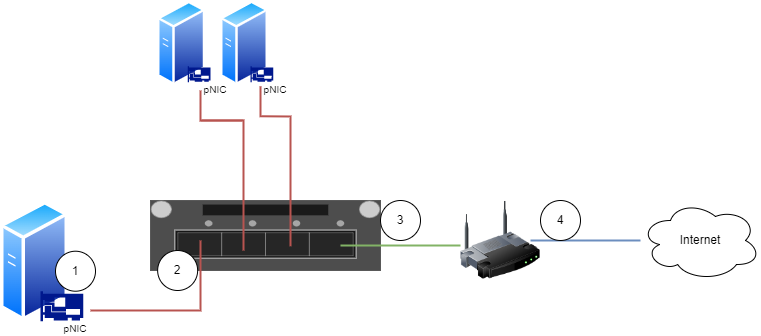
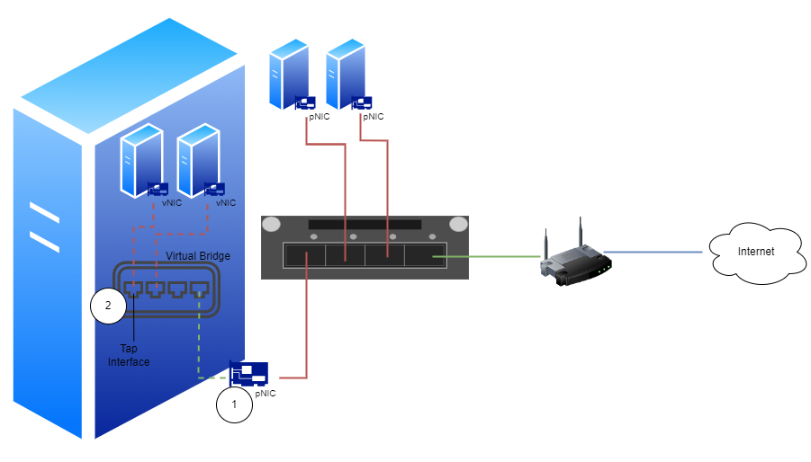
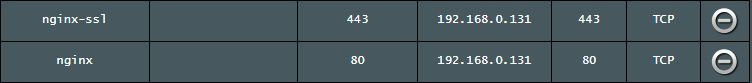
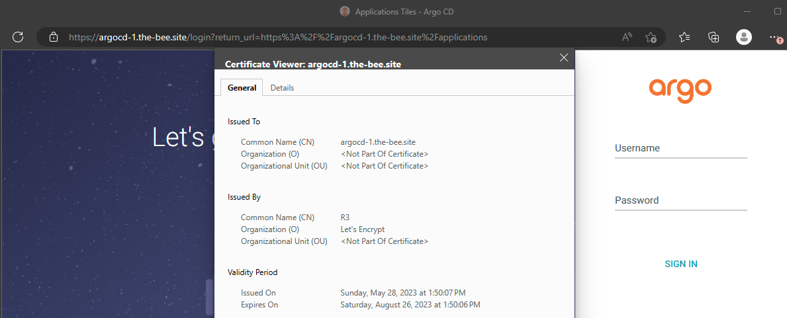

# Multipass: Bridging

## About <a id="about"></a>
This document describes how to setup Multipass to use a network bridge.  

## Description <a id="description"></a>
We will create a network bridge on the Multipass host to the same network the host is on. This setup will allow us to have the VMs on 
the same subnet as the host. And when we're running cloud services like Kubernetes we can allocate IPs to the loadbalancers from this 
range as well. This makes the rest of the routing outside the Multipass host easier.  

You can of course bridge the Multipass VMs to whatever network you want. If you have access to external IPs, that would be even more 
perfect.  

## Table of contents <a id="table-of-contents"></a>
1. [About](#about)
2. [Description](#description)
3. [Table of contents](#table-of-contents)
4. [What is a bridge](#what-is-a-bridge)
    1. [Physical brigde](#physical-bridge)
    2. [Virtual brigde](#virtual-bridge)
5. [Create bridge on host](#create-bridge-on-host)
6. [Install Multipass](#install-multipass)
7. [Install LXD](#install-lxd)
8. [Connect Multipass to LXD](#connect-multipass-to-lxd)
9. [Test network bridge](#test-network-bridge)
10. [Related links](#related-links)

## What is a bridge <a id="what-is-a-bridge"></a>
In the 2004 version of the [IEEE 802.1 standard](https://ieeexplore.ieee.org/document/1309630) a **bridge** was defined as:

> MAC Bridges, as specified by this standard, allow communications between end stations attached to separate LANs, each with its own 
> separate MAC, to be transparent to logical link control (LLC) and network layer protocols, just as if the stations were attached to 
> the same LAN.  

A **bridge** works just like a **switch**. You could call a bridge a two-port switch. And you could call a switch a multi-port bridge. 
They are the same thing.  

### Physical brigde <a id="physical-bridge"></a>
To understand how a virtual bridge works, it's easiest to first look at a physical bridge (switch).  

Imagine a simple home- or smalloffice network with a router connected to the internet, and it also has a switch connected to the 
router, so other computers get access to each other and the internet:



The data flows like this from the physical machine to the internet:
1. A packet is sent to the physical network card (pNIC) on the physical machine
2. The pNIC adds a L2 header to the packet with source address being the pNIC's MAC and destination address being the router's MAC and 
sends it to the bridge port
3. The bridge forwards the L2 frame to the uplink port
4. The router receives the packet and routes it to the next hop of it's final destination

> :warning: **Note:** MAC learning is out of scope of this explaination, so let's just assume this network is already allknowing. 

### Virtual brigde <a id="virtual-bridge"></a>
In a virtualized network, everything is the same. The only difference is that instead of the physical bridge that we could touch, we 
now have a virtual one:



The pNIC (1) will now act as a router between the pNIC and the virtual bridge (2). The ports on the virtual bridge are called tap interfaces.

The virtual bridge is transparent to the virtual hosts and the rest of the network. The virtual network cards (vNIC) behaves just like the 
physical ones (pNIC).  

## Create bridge on host <a id="create-bridge-on-host"></a>
Let's test this on Ubuntu Server.  

First we need to create the virtual bridge on the Multipass host. Get network information from host:
```console
bee@multipassus:~$ ip a
2: eth0: <BROADCAST,MULTICAST,UP,LOWER_UP> mtu 1500 qdisc mq state UP group default qlen 1000
    link/ether 00:15:5d:00:1e:13 brd ff:ff:ff:ff:ff:ff
    inet 192.168.0.204/24 metric 100 brd 192.168.0.255 scope global dynamic eth0
       valid_lft 73435sec preferred_lft 73435sec
    inet6 fe80::215:5dff:fe00:1e13/64 scope link
       valid_lft forever preferred_lft forever
```

The host's pNIC **eth0** has macaddress **00:15:5d:00:1e:13** and is on network **192.168.0.0/24**.  

Using this information we create the bridge with netplan:
```yaml
network:
  version: 2
  renderer: networkd
  ethernets:
    eth0:
      dhcp4: false
      dhcp6: true
      match:
        macaddress: 00:15:5d:00:1e:13
  bridges:
    br0:
      dhcp4: false
      addresses:
        - 192.168.0.80/24
      interfaces:
        - eth0
      routes:
        - to: default
          via: 192.168.0.1
      nameservers:
        addresses: [192.168.0.1,8.8.4.4,1.1.1.1]
      parameters:
        forward-delay: 0
        stp: false
      optional: true
```

I've used the **mac** and ip information from above, and set the bridge to have the static ip **192.168.0.80/24**. You need to change this to values 
matching your network.  

This goes somewhere in **/etc/netplan/**, e.g. **/etc/netplan/50-custom.yaml**
```console
bee@multipassus:~$ sudo nano /etc/netplan/50-custom.yaml
bee@multipassus:~$ sudo netplan try
br0: reverting custom parameters for bridges and bonds is not supported

Please carefully review the configuration and use 'netplan apply' directly.
bee@multipassus:~$ sudo netplan apply
```

Check that bridge was created:
```console
bee@multipassus:~$ ip a
2: eth0: <BROADCAST,MULTICAST,UP,LOWER_UP> mtu 1500 qdisc mq master br0 state UP group default qlen 1000
    link/ether 00:15:5d:00:1e:13 brd ff:ff:ff:ff:ff:ff
4: br0: <BROADCAST,MULTICAST,UP,LOWER_UP> mtu 1500 qdisc noqueue state UP group default qlen 1000
    link/ether 4a:6c:c8:6e:fd:57 brd ff:ff:ff:ff:ff:ff
    inet 192.168.0.80/24 brd 192.168.0.255 scope global br0
       valid_lft forever preferred_lft forever
    inet6 fe80::486c:c8ff:fe6e:fd57/64 scope link
       valid_lft forever preferred_lft forever

bee@multipassus:~$ brctl show
bridge name     bridge id               STP enabled     interfaces
br0             8000.4a6cc86efd57       no              eth0
mpqemubr0               8000.525400926d15       no
bee@multipassus:~$ ifconfig br0
br0: flags=4163<UP,BROADCAST,RUNNING,MULTICAST>  mtu 1500
        inet 192.168.0.80  netmask 255.255.255.0  broadcast 192.168.0.255
        inet6 fe80::486c:c8ff:fe6e:fd57  prefixlen 64  scopeid 0x20<link>
        ether 4a:6c:c8:6e:fd:57  txqueuelen 1000  (Ethernet)
        RX packets 2160  bytes 428630 (428.6 KB)
        RX errors 0  dropped 0  overruns 0  frame 0
        TX packets 951  bytes 235612 (235.6 KB)
        TX errors 0  dropped 0 overruns 0  carrier 0  collisions 0

bee@multipassus:~$ ifconfig eth0
eth0: flags=4163<UP,BROADCAST,RUNNING,MULTICAST>  mtu 1500
        ether 00:15:5d:00:1e:13  txqueuelen 1000  (Ethernet)
        RX packets 3041550  bytes 2725693894 (2.7 GB)
        RX errors 0  dropped 0  overruns 0  frame 0
        TX packets 153629  bytes 11462125 (11.4 MB)
        TX errors 0  dropped 0 overruns 0  carrier 0  collisions 0
```

And finally test that network communication from the host is still working:
```console
bee@multipassus:~$ dig www.google.no | grep -v ';'
www.google.no.          53      IN      A       142.250.74.131
```

## Install Multipass <a id="install-multipass"></a>
To install Multipass, simply execute:
```console
bee@multipassus:~$ sudo snap install multipass
multipass 1.11.0 from Canonical✓ installed
```

## Install LXD <a id="install-lxd"></a>
LXD is pre-installed on Ubuntu Server. We will update the LXD to the latest stable release:
```console
bee@multipassus:~$ sudo snap remove --purge lxd && sudo snap install lxd
lxd removed
lxd 5.13-8e2d7eb from Canonical✓ installed
```

On other systems, the lxd package can be installed using:
```console
sudo snap install lxd
```

For the LXD 5.0 LTS release, use:
```console
sudo snap install lxd --channel=5.0/stable
```

Initialize LXD:
```console
bee@multipassus:~$ sudo lxd init
Would you like to use LXD clustering? (yes/no) [default=no]:
Do you want to configure a new storage pool? (yes/no) [default=yes]:
Name of the new storage pool [default=default]:
Name of the storage backend to use (ceph, dir, lvm, zfs, btrfs) [default=zfs]: dir
Would you like to connect to a MAAS server? (yes/no) [default=no]:
Would you like to create a new local network bridge? (yes/no) [default=yes]: no
Would you like to configure LXD to use an existing bridge or host interface? (yes/no) [default=no]:
Would you like the LXD server to be available over the network? (yes/no) [default=no]:
Would you like stale cached images to be updated automatically? (yes/no) [default=yes]:
Would you like a YAML "lxd init" preseed to be printed? (yes/no) [default=no]:
```

The key point here is to answer **No** to create a new local network bridge, since we have already created **br0**.

## Connect Multipass to LXD <a id="connect-multipass-to-lxd"></a>
On Ubuntu Multipass uses **qemu** as the default backend. Bridging is not implemented with this backend, so we need to 
configure Multipass to use **LXD** instead.

> :warning: **Note:** When you change the Multipass driver any instances running on the current backend will be hidden. It is 
recommended to stop all running instances with **multipass stop --all** before switching.

Set LXD as the local driver:
```console
bee@multipassus:~$ multipass get local.driver
qemu
bee@multipassus:~$ multipass stop --all
bee@multipassus:~$ multipass set local.driver=lxd
bee@multipassus:~$ multipass get local.driver
lxd
```

Connect Multipass to LXD:
```console
bee@multipassus:~$ sudo snap connect multipass:lxd lxd
bee@multipassus:~$ sudo snap connections multipass
Interface          Plug                         Slot                Notes
firewall-control   multipass:firewall-control   :firewall-control   -
home               multipass:all-home           :home               -
home               multipass:home               :home               -
kvm                multipass:kvm                :kvm                -
libvirt            multipass:libvirt            -                   -
lxd                multipass:lxd                lxd:lxd             -
multipass-support  multipass:multipass-support  :multipass-support  -
network            multipass:network            :network            -
network-bind       multipass:network-bind       :network-bind       -
network-control    multipass:network-control    :network-control    -
network-manager    multipass:network-manager    :network-manager    -
network-observe    multipass:network-observe    :network-observe    -
removable-media    multipass:removable-media    -                   -
system-observe     multipass:system-observe     :system-observe     -
unity7             multipass:unity7             :unity7             -
wayland            multipass:wayland            :wayland            -
x11                multipass:x11                :x11                -
```

## Test network bridge <a id="test-network-bridge"></a>
Multipass should now list our bridge as a usable network:
```console
bee@multipassus:~$ multipass networks
Name   Type      Description
br0    bridge    Network bridge with eth0
eth0   ethernet  Ethernet device
mpbr0  bridge    Network bridge for Multipass
```

> :warning: **Note:** If you get an error message with **LXD object not found**, just launch a machine with **multipass launch** and try again

We see that we now have our physical ethernet card **eth0** and two bridges **mpbr0** and **br0**.  

**mpbr0** is the default bridge that Multipass install. It's NATed to **10.71.63.1/24**
```console
bee@multipassus:~$ ip a
5: mpbr0: <BROADCAST,MULTICAST,UP,LOWER_UP> mtu 1500 qdisc noqueue state UP group default qlen 1000
    link/ether 00:16:3e:7e:98:87 brd ff:ff:ff:ff:ff:ff
    inet 10.71.63.1/24 scope global mpbr0
       valid_lft forever preferred_lft forever
    inet6 fd42:14b6:93d6:bcb5::1/64 scope global
       valid_lft forever preferred_lft forever
    inet6 fe80::216:3eff:fe7e:9887/64 scope link
       valid_lft forever preferred_lft forever
```

Launching a VM with multipass without any networking options creates a tap interface on the **mpbr0**, and connects the VM to that:
```console
bee@multipassus:~$ multipass launch
Launched: venerable-whitethroat
bee@multipassus:~$ multipass list
Name                    State             IPv4             Image
venerable-whitethroat   Running           10.71.63.170     Ubuntu 22.04 LTS
```

On the host we can see that it has created a tap interface for the **mpbr0** bridge.
```console
bee@multipassus:~$ ip a
6: tap4682d4fc: <BROADCAST,MULTICAST,UP,LOWER_UP> mtu 1500 qdisc mq master mpbr0 state UP group default qlen 1000
    link/ether 7a:05:38:af:05:4f brd ff:ff:ff:ff:ff:ff
```

But this is not what we wanted. If we instead instruct Multipass to use the **br0** bridge we created, we should get an instance on 
the **192.168.0.0/24** subnet:
```console
bee@multipassus:~$ multipass launch --network br0
Launched: vigilant-sheep
bee@multipassus:~$ multipass list
Name                    State             IPv4             Image
venerable-whitethroat   Running           10.71.63.170     Ubuntu 22.04 LTS
vigilant-sheep          Running           10.71.63.2       Ubuntu 22.04 LTS
                                          192.168.0.212
```

On the multipass host we can see that it now created tap interfaces for both **mpbr0** and **br0**:
```console
bee@multipassus:~$ ip a
7: tapf2898d59: <BROADCAST,MULTICAST,UP,LOWER_UP> mtu 1500 qdisc mq master mpbr0 state UP group default qlen 1000
    link/ether be:c7:db:51:44:0f brd ff:ff:ff:ff:ff:ff
8: tap950d34eb: <BROADCAST,MULTICAST,UP,LOWER_UP> mtu 1500 qdisc mq master br0 state UP group default qlen 1000
    link/ether c2:f1:84:65:2b:36 brd ff:ff:ff:ff:ff:ff
```

Open a shell to the VM, and check that the network interfaces got created:
```console
bee@multipassus:~$ multipass shell vigilant-sheep
Welcome to Ubuntu 22.04.2 LTS (GNU/Linux 5.15.0-72-generic x86_64)

ubuntu@vigilant-sheep:~$ ip a
2: enp5s0: <BROADCAST,MULTICAST,UP,LOWER_UP> mtu 1500 qdisc mq state UP group default qlen 1000
    link/ether 52:54:00:30:39:85 brd ff:ff:ff:ff:ff:ff
    inet 10.71.63.2/24 metric 100 brd 10.71.63.255 scope global dynamic enp5s0
       valid_lft 3518sec preferred_lft 3518sec
    inet6 fd42:14b6:93d6:bcb5:5054:ff:fe30:3985/64 scope global mngtmpaddr noprefixroute
       valid_lft forever preferred_lft forever
    inet6 fe80::5054:ff:fe30:3985/64 scope link
       valid_lft forever preferred_lft forever
3: enp6s0: <BROADCAST,MULTICAST,UP,LOWER_UP> mtu 1500 qdisc mq state UP group default qlen 1000
    link/ether 52:54:00:22:75:49 brd ff:ff:ff:ff:ff:ff
    inet 192.168.0.212/24 metric 200 brd 192.168.0.255 scope global dynamic enp6s0
       valid_lft 86320sec preferred_lft 86320sec
    inet6 fe80::5054:ff:fe22:7549/64 scope link
       valid_lft forever preferred_lft forever
```

Test network connectivity to the gateway and internet. And a dns lookup while we're at it:
```console
ubuntu@vigilant-sheep:~$ ping 192.168.0.1
PING 192.168.0.1 (192.168.0.1) 56(84) bytes of data.
64 bytes from 192.168.0.1: icmp_seq=1 ttl=64 time=1.16 ms

ubuntu@vigilant-sheep:~$ ping 8.8.4.4
PING 8.8.4.4 (8.8.4.4) 56(84) bytes of data.
64 bytes from 8.8.4.4: icmp_seq=1 ttl=59 time=9.61 ms

ubuntu@vigilant-sheep:~$ dig www.google.no | grep -v ';'
www.google.no.          81      IN      A       142.250.74.131
```

Test network connectivity to the VM from another physical host on the **192.168.0.0/24** subnet:
```console
bee@multipassus:~$ ssh bee@192.168.0.172
bee@192.168.0.172's password:
Welcome to Ubuntu 14.04.3 LTS (GNU/Linux 3.13.0-66-generic x86_64)

bee@physicalhost1:~$ ping vigilant-sheep
PING vigilant-sheep (192.168.0.212) 56(84) bytes of data.
64 bytes from vigilant-sheep (192.168.0.212): icmp_seq=1 ttl=64 time=1.67 ms
```

This is looking good so far!

## Example Deployment <a id="example-deployment"></a>
Let's see how all this works with a practical example.  

We will deploy ArgoCD and then setup Ingress with an EXTERNAL-IP from MetalLB to route traffic to the ArgoCD Dashboard.  

First deploy a VM with ArgoCD. Remember to add **--network br0** so it uses our bridge:
```console
bee@multipassus:~$ wget https://raw.githubusercontent.com/BeeLazy/Cookbook/main/cloud/cloud-init/MicroK8s-ArgoCD-2.7.1.yaml
2023-05-28 12:31:31 (37.2 MB/s) - ‘MicroK8s-ArgoCD-2.7.1.yaml’ saved [2726/2726]

bee@multipassus:~$ multipass launch --cloud-init MicroK8s-ArgoCD-2.7.1.yaml \
--timeout 1200 \
--name argolab271 \
--memory 12G \
--cpus 6 \
--disk 50G \
--network br0
Launched: argolab271
```

Check that it got created with IP on our bridge subnet **192.168.0.0/24**:
```console
bee@multipassus:~$ multipass list
Name                    State             IPv4             Image
argolab271              Running           10.71.63.149     Ubuntu 22.04 LTS
                                          192.168.0.206
                                          10.1.197.64
```

Next open a **shell** to the VM:
```console
bee@multipassus:~$ multipass shell argolab271
Welcome to Ubuntu 22.04.2 LTS (GNU/Linux 5.15.0-72-generic x86_64)
ubuntu@argolab271:~$
```

And enable **addons** we need:
```console
ubuntu@argolab271:~$ microk8s enable ingress
Ingress is enabled

ubuntu@argolab271:~$ microk8s enable metallb
Infer repository core for addon metallb
Enabling MetalLB
Enter each IP address range delimited by comma (e.g. '10.64.140.43-10.64.140.49,192.168.0.105-192.168.0.111'): 192.168.0.131-192.168.0.140
MetalLB is enabled

ubuntu@argolab271:~$ microk8s enable rbac
RBAC is enabled

ubuntu@argolab271:~$ microk8s enable cert-manager
Enabled cert-manager
```

Create a certificate **ClusterIssuer**:
```console
microk8s kubectl apply -f - <<EOF
apiVersion: cert-manager.io/v1
kind: ClusterIssuer
metadata:
 name: lets-encrypt
spec:
 acme:
   # The email must be changed to a valid address
   email: user@example.com
   server: https://acme-v02.api.letsencrypt.org/directory
   privateKeySecretRef:
     # Secret resource that will be used to store the account's private key.
     name: lets-encrypt-private-key
   # Add a single challenge solver, HTTP01 using nginx
   solvers:
   - http01:
       ingress:
         class: public
EOF
```

> :warning: **Note:** Remember to change the **email** to your own.  

Create the **MetalLB** loadbalancer config.  

Contents of nginx-ingress-metallb.yaml
```yaml
apiVersion: v1
kind: Service
metadata:
  name: ingress
  namespace: ingress
spec:
  selector:
    name: nginx-ingress-microk8s
  type: LoadBalancer
  # loadBalancerIP is optional. MetalLB will automatically allocate an IP from its pool if not
  # specified. You can also specify one manually.
  # loadBalancerIP: x.y.z.a
  ports:
    - name: http
      protocol: TCP
      port: 80
      targetPort: 80
    - name: https
      protocol: TCP
      port: 443
      targetPort: 443
```

Apply the loadbalancer config:
```console
ubuntu@argolab271:~$ microk8s kubectl create -f nginx-ingress-metallb.yaml
service/ingress created
```

Check what **EXTERNAL-IP** the loadbalancer got:
```console
ubuntu@argolab271:~$ microk8s kubectl -n ingress get svc
ubuntu@argolab271:~$ microk8s kubectl -n ingress get svc
NAME      TYPE           CLUSTER-IP       EXTERNAL-IP     PORT(S)                      AGE
ingress   LoadBalancer   10.152.183.235   192.168.0.131   80:31165/TCP,443:31374/TCP   15s
```

Not very surprisingly, it got the first IP from the IP pool we assigned to MetalLB; **192.168.0.131**  

For this to be reachable from the internet, I've added the entry **argocd-1.the-bee.site** to my external DNS, and 
I have added portforwarding rules on my external router, so traffic on port **80** and **443** get routed to our 
loadBalancerIP **192.168.0.131**:



Finally create an **Ingress** pointing the DNS entry to the service. Let ssl passthru to the service:
```console
microk8s kubectl apply -n argocd -f - <<EOF
apiVersion: networking.k8s.io/v1
kind: Ingress
metadata:
 name: argocd-1-ingress
 annotations:
   cert-manager.io/cluster-issuer: lets-encrypt
   nginx.ingress.kubernetes.io/force-ssl-redirect: "true"
   nginx.ingress.kubernetes.io/backend-protocol: "HTTPS"
spec:
 ingressClassName: nginx
 tls:
 - hosts:
   - argocd-1.the-bee.site
   secretName: argocd-1-ingress-tls
 rules:
 - host: argocd-1.the-bee.site
   http:
     paths:
     - backend:
         service:
           name: argocd-server
           port:
             number: 443
       path: /
       pathType: Prefix
EOF
```

Verify that certificate was created successfully:
```console
ubuntu@argolab271:~$ kubectl get certificate -A
NAMESPACE   NAME                   READY   SECRET                 AGE
argocd      argocd-1-ingress-tls   True    argocd-1-ingress-tls   28s
```

The site should now be reachable from internet at **https://argocd-1.the-bee.site**:



## Related links <a id="related-links"></a>
[multipass networks command - multipass.run](https://multipass.run/docs/networks-command)  
[Bridging Multipass - multipass.run](https://multipass.run/docs/create-an-instance#heading--bridging)  
[multipass networks command - ubuntu.com](https://discourse.ubuntu.com/t/multipass-networks-command/19542)  
[IEEE 802.1 standard - ieee.org](https://ieeexplore.ieee.org/document/1309630)  
[Linux bridge - hechao.li](https://hechao.li/2017/12/13/linux-bridge-part1/)  
