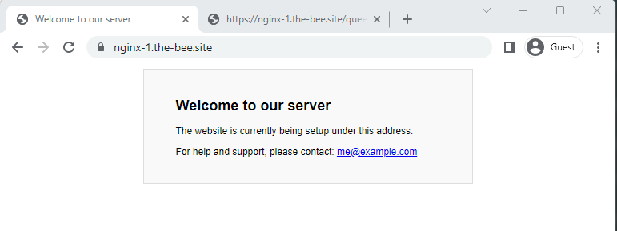
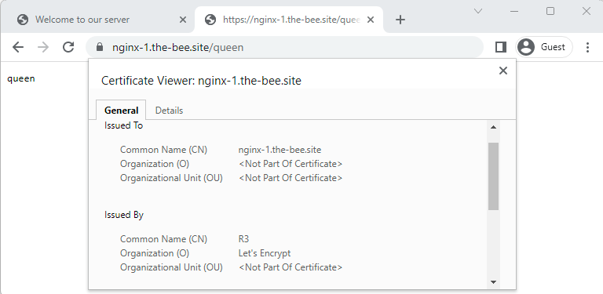
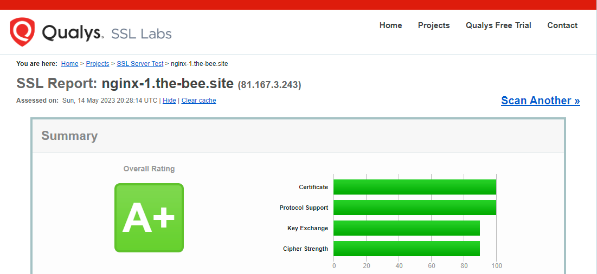

# MicroK8s: CertManager

## About <a id="about"></a>
This document describes how-to setup Kubernetes with automatic SSH certificate management.  

## Description <a id="description"></a> 
In this guilde we will setup **cert-manger**, and use it to configure a **nginx** service to get automatic TLS certificates from **Let's Encrypt**.  

To follow this guide, you will need:
- A MicroK8s cluster with a public IP address. This is required to complete the HTTP challenges of Let's Encrypt
  - It can be an internal address, as long as traffic from a public IP is routed to it
- A hostname that resolves to your public IP address, e.g. nginx-1.the-bee.site
- A properly configured ingress class for your MicroK8s cluster. You can get that by following the [Accessing services docs](MicroK8s-AccessingServices.md)
  - In this guide I've used **nginx-1.the-bee.site** instead of **my-nginx.pretenddomain.com**, except from that everything is the same as in the **accessing services docs**

## Table of contents <a id="table-of-contents"></a>
1. [About](#about)
2. [Description](#description)
3. [Table of contents](#table-of-contents)
4. [Create the test environment](#create-the-test-environment)
10. [Related links](#related-links)

## Multipass network routing
Since we have our Kubernetes cluster, and load balancer running like a blackbox in VMs, we will need to route the incoming traffic on the host to the VM. 
This needs to be done on all the hosts that can run the MetalLB load balancer. If your MetalLB setup has IPs with a range from your host network, then you 
don't need to do this step. Find the **EXTERNAL-IP** of the load balancer:
```console
ubuntu@argolab271:~$ microk8s kubectl -n ingress get svc
NAME      TYPE           CLUSTER-IP      EXTERNAL-IP   PORT(S)                      AGE
ingress   LoadBalancer   10.152.183.69   10.95.75.50   80:31691/TCP,443:30842/TCP   140m
```

Then add routing to that ip on port **80** and **443** on the **host network card** that leads to the internet.
```console
bee@multipassus:~$ sudo iptables -t nat -I PREROUTING 1 -i eth0 -p tcp --dport 80 -j DNAT --to-destination 10.95.75.50:80
bee@multipassus:~$ sudo iptables -t nat -I PREROUTING 1 -i eth0 -p tcp --dport 443 -j DNAT --to-destination 10.95.75.50:443
bee@multipassus:~$ sudo iptables -I FORWARD 1 -p tcp -d 10.95.75.50 --dport 80 -j ACCEPT
bee@multipassus:~$ sudo iptables -I FORWARD 1 -p tcp -d 10.95.75.50 --dport 443 -j ACCEPT
```

## Enable RBAC
Enable RBAC and setup the admin user
```console
microk8s enable rbac
```

Contents of **rbac-dashboard-adminuser.yaml**
```console
apiVersion: v1
kind: ServiceAccount
metadata:
  name: admin-user
  namespace: kube-system
```

Contents of **rbac-adminuser-clusterrolebinding.yaml**
```console
apiVersion: rbac.authorization.k8s.io/v1
kind: ClusterRoleBinding
metadata:
  name: admin-user
roleRef:
  apiGroup: rbac.authorization.k8s.io
  kind: ClusterRole
  name: cluster-admin
subjects:
- kind: ServiceAccount
  name: admin-user
  namespace: kube-system
```

Apply the two configs to create the ServiceAccount and the ClusterRoleBinding
```console
wget https://raw.githubusercontent.com/BeeLazy/Cookbook/main/cloud/examples/microk8s-certmanager/rbac-dashboard-adminuser.yaml
wget https://raw.githubusercontent.com/BeeLazy/Cookbook/main/cloud/examples/microk8s-certmanager/rbac-adminuser-clusterrolebinding.yaml

kubectl apply -f rbac-dashboard-adminuser.yaml
kubectl apply -f rbac-adminuser-clusterrolebinding.yaml
```

## Enable cert-manager
With everything setup we're ready to enable the **cert-manager** addon:
```console
ubuntu@argolab271:~$ microk8s enable cert-manager
Infer repository core for addon cert-manager
Enable DNS addon
Infer repository core for addon dns
Addon core/dns is already enabled
Enabling cert-manager
namespace/cert-manager created
customresourcedefinition.apiextensions.k8s.io/certificaterequests.cert-manager.io created
customresourcedefinition.apiextensions.k8s.io/certificates.cert-manager.io created
customresourcedefinition.apiextensions.k8s.io/challenges.acme.cert-manager.io created
customresourcedefinition.apiextensions.k8s.io/clusterissuers.cert-manager.io created
customresourcedefinition.apiextensions.k8s.io/issuers.cert-manager.io created
customresourcedefinition.apiextensions.k8s.io/orders.acme.cert-manager.io created
serviceaccount/cert-manager-cainjector created
serviceaccount/cert-manager created
serviceaccount/cert-manager-webhook created
configmap/cert-manager-webhook created
clusterrole.rbac.authorization.k8s.io/cert-manager-cainjector created
clusterrole.rbac.authorization.k8s.io/cert-manager-controller-issuers created
clusterrole.rbac.authorization.k8s.io/cert-manager-controller-clusterissuers created
clusterrole.rbac.authorization.k8s.io/cert-manager-controller-certificates created
clusterrole.rbac.authorization.k8s.io/cert-manager-controller-orders created
clusterrole.rbac.authorization.k8s.io/cert-manager-controller-challenges created
clusterrole.rbac.authorization.k8s.io/cert-manager-controller-ingress-shim created
clusterrole.rbac.authorization.k8s.io/cert-manager-view created
clusterrole.rbac.authorization.k8s.io/cert-manager-edit created
clusterrole.rbac.authorization.k8s.io/cert-manager-controller-approve:cert-manager-io created
clusterrole.rbac.authorization.k8s.io/cert-manager-controller-certificatesigningrequests created
clusterrole.rbac.authorization.k8s.io/cert-manager-webhook:subjectaccessreviews created
clusterrolebinding.rbac.authorization.k8s.io/cert-manager-cainjector created
clusterrolebinding.rbac.authorization.k8s.io/cert-manager-controller-issuers created
clusterrolebinding.rbac.authorization.k8s.io/cert-manager-controller-clusterissuers created
clusterrolebinding.rbac.authorization.k8s.io/cert-manager-controller-certificates created
clusterrolebinding.rbac.authorization.k8s.io/cert-manager-controller-orders created
clusterrolebinding.rbac.authorization.k8s.io/cert-manager-controller-challenges created
clusterrolebinding.rbac.authorization.k8s.io/cert-manager-controller-ingress-shim created
clusterrolebinding.rbac.authorization.k8s.io/cert-manager-controller-approve:cert-manager-io created
clusterrolebinding.rbac.authorization.k8s.io/cert-manager-controller-certificatesigningrequests created
clusterrolebinding.rbac.authorization.k8s.io/cert-manager-webhook:subjectaccessreviews created
role.rbac.authorization.k8s.io/cert-manager-cainjector:leaderelection created
role.rbac.authorization.k8s.io/cert-manager:leaderelection created
role.rbac.authorization.k8s.io/cert-manager-webhook:dynamic-serving created
rolebinding.rbac.authorization.k8s.io/cert-manager-cainjector:leaderelection created
rolebinding.rbac.authorization.k8s.io/cert-manager:leaderelection created
rolebinding.rbac.authorization.k8s.io/cert-manager-webhook:dynamic-serving created
service/cert-manager created
service/cert-manager-webhook created
deployment.apps/cert-manager-cainjector created
deployment.apps/cert-manager created
deployment.apps/cert-manager-webhook created
mutatingwebhookconfiguration.admissionregistration.k8s.io/cert-manager-webhook created
validatingwebhookconfiguration.admissionregistration.k8s.io/cert-manager-webhook created
Waiting for cert-manager to be ready.
...ready
Enabled cert-manager

===========================

Cert-manager is installed. As a next step, try creating a ClusterIssuer
for Let's Encrypt by creating the following resource:

$ microk8s kubectl apply -f - <<EOF
---
apiVersion: cert-manager.io/v1
kind: ClusterIssuer
metadata:
  name: letsencrypt
spec:
  acme:
    # You must replace this email address with your own.
    # Let's Encrypt will use this to contact you about expiring
    # certificates, and issues related to your account.
    email: me@example.com
    server: https://acme-v02.api.letsencrypt.org/directory
    privateKeySecretRef:
      # Secret resource that will be used to store the account's private key.
      name: letsencrypt-account-key
    # Add a single challenge solver, HTTP01 using nginx
    solvers:
    - http01:
        ingress:
          class: public
EOF

Then, you can create an ingress to expose 'my-service:80' on 'https://my-service.example.com' with:

$ microk8s enable ingress
$ microk8s kubectl create ingress my-ingress     --annotation cert-manager.io/cluster-issuer=letsencrypt     --rule 'my-service.example.com/*=my-service:80,tls=my-service-tls'
```

A **ClusterIssuer** resource is used to configure an account with Let's Encrypt. All you need is a valid email address.  

Create a ClusterIssuer called **lets-encrypt** with the command below. Make sure to replace **user@example.com** below with your email
```console
ubuntu@argolab271:~$ microk8s kubectl apply -f - <<EOF
apiVersion: cert-manager.io/v1
kind: ClusterIssuer
metadata:
 name: lets-encrypt
spec:
 acme:
   # The email must be changed to a valid address
   email: user@example.com
   server: https://acme-v02.api.letsencrypt.org/directory
   privateKeySecretRef:
     # Secret resource that will be used to store the account's private key.
     name: lets-encrypt-priviate-key
   # Add a single challenge solver, HTTP01 using nginx
   solvers:
   - http01:
       ingress:
         class: public
EOF
clusterissuer.cert-manager.io/lets-encrypt created
```

> :warning: **Note**: Remember to change the email

Check the status of it:
```console
ubuntu@argolab271:~$ microk8s kubectl get clusterissuer -o wide
NAME           READY   STATUS                                                 AGE
lets-encrypt   True    The ACME account was registered with the ACME server   59m
```

## Configure Ingress
The cluster is now setup to issue certificates. I've created a DNS record **nginx-1.the-bee.site** on my public DNS server that 
points to my external IP.  

And finally create the Ingress rule
```console
microk8s kubectl apply -f - <<EOF
apiVersion: networking.k8s.io/v1
kind: Ingress
metadata:
 name: nginx-1-ingress
 annotations:
   cert-manager.io/cluster-issuer: lets-encrypt
spec:
 tls:
 - hosts:
   - nginx-1.the-bee.site
   secretName: nginx-1-ingress-tls
 rules:
 - host: nginx-1.the-bee.site
   http:
     paths:
     - backend:
         service:
           name: nginx-1
           port:
             number: 80
       path: /
       pathType: Exact
EOF
```

> :warning: **Note**: Remember to change the host records to your domain

This should now work from the internet  


Also notice that everything behing Ingress is now certified. Even the echo service  


Generating a SSL report of the site leads to far better results than the self signed certificate we started with  


## Related links <a id="related-links"></a>
[CertManager Addon - microk8s.io](https://microk8s.io/docs/addon-cert-manager)  
[RBAC User - github.com](https://github.com/kubernetes/dashboard/blob/master/docs/user/access-control/creating-sample-user.md)  
