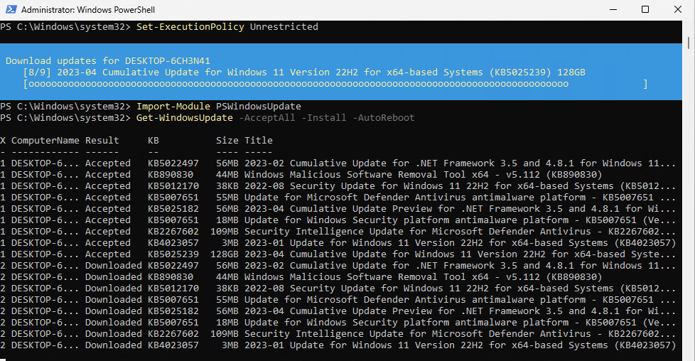
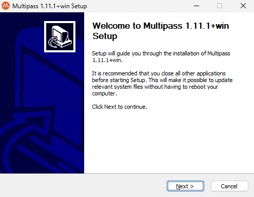
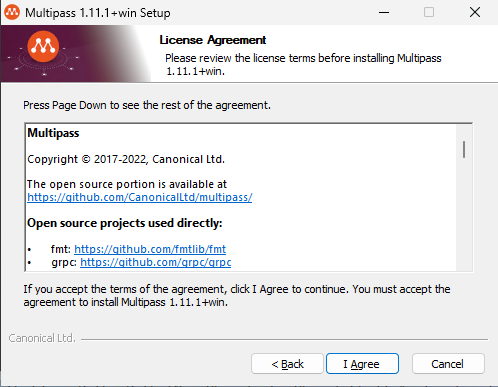
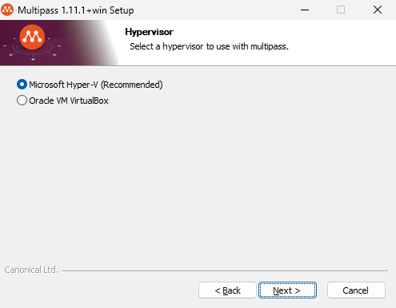
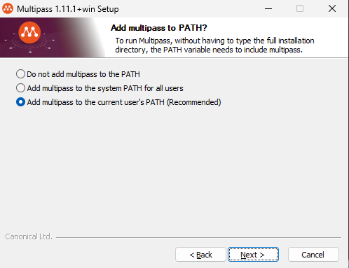
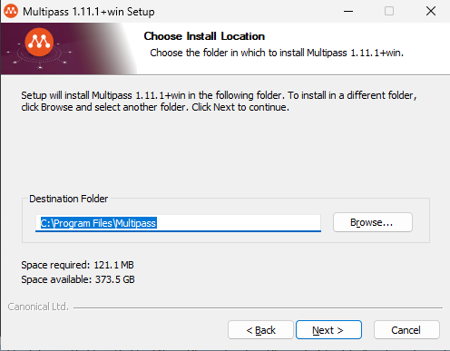
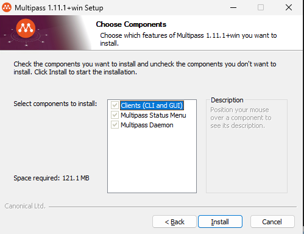
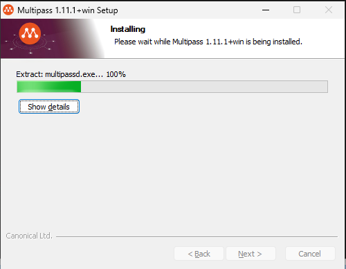
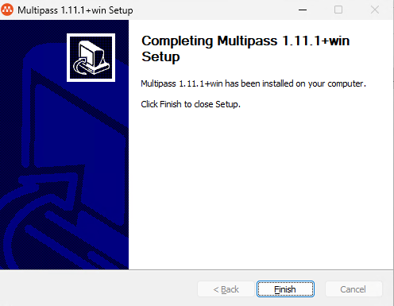

# Multipass: How-to install

## About <a id="about"></a>
This document describes how to install **Multipass**.  

## Description <a id="description"></a>
Multipass is a tool to generate cloud-style Ubuntu VMs quickly on Linux, macOS, and Windows.  

It gives you a simple but powerful CLI that allows you to quickly access an Ubuntu command line or create your own local mini-cloud.  

## Table of contents <a id="table-of-contents"></a>
1. [About](#about)
2. [Description](#description)
3. [Table of contents](#table-of-contents)
4. [Install Multipass](#install-multipass)
    1. [Install on Linux](#install-on-linux)
	    1. [Update Ubuntu host](#update-ubuntu-host)
        2. [Prerequisites](#linux-prerequisites)
		3. [Install](#linux-install)
		4. [Grant access](#grant-access)
		5. [Uninstall](#linux-uninstall)
	2. [Install on Windows](#install-on-windows)
	    1. [Update Windows host](#update-windows-host)
	    2. [Prerequisites](#windows-prerequisites)
		3. [Enable Hyper-V](#enable-hyper-v)
		4. [Install](#windows-install)
		5. [Uninstall](#windows-uninstall)
5. [Test installation](#test-installation)
6. [Cleanup](#cleanup)
7. [Related links](#related-links)

## Install Multipass <a id="install-multipass"></a>
Multipass can be installed on Linux, macOS, and Windows.  

### Install on Linux <a id="install-on-linux"></a>

#### Update Ubuntu host <a id="update-ubuntu-host"></a>
First we'll make sure our Ubuntu host is up to date
```console
sudo apt-get update && sudo apt-get dist-upgrade && sudo snap refresh
```

#### Prerequisites  <a id="linux-prerequisites"></a>
Multipass for Linux is published as a snap package.  
If you dont have snap command, see [Installing snapd](https://snapcraft.io/docs/installing-snapd)  

#### Install <a id="linux-install"></a>
To install Multipass, simply execute:
```console
bee@multipassus:~$ sudo snap install multipass
multipass 1.11.0 from Canonical✓ installed
```

For architectures other than **amd64**, you’ll need the **beta** channel at the moment.  

You can also use the **edge** channel to get the latest development build:
```console
sudo snap install multipass --edge
```

#### Grant access <a id="grant-access"></a>
Make sure you’re part of the group that Multipass gives write access to its socket (**sudo** in this case, but it may also be **adm** 
or **admin**, depending on your distribution):
```console
bee@multipassus:~$ ls -l /var/snap/multipass/common/multipass_socket
srw-rw---- 1 root sudo 0 May  6 14:47 /var/snap/multipass/common/multipass_socket
bee@multipassus:~$ groups | grep sudo
bee adm cdrom sudo dip plugdev lxd
```

#### Uninstall <a id="linux-uninstall"></a>
To uninstall Multipass, simply run:
```console
bee@multipassus:~$ sudo snap remove multipass
2023-05-06T14:49:11Z INFO Waiting for "snap.multipass.multipassd.service" to stop.
Disconnect multipass:all-home from snapd:home
multipass removed
```

### Install on Windows <a id="install-on-windows"></a>

#### Update Windows host <a id="update-windows-host"></a>
First we'll make sure our Windows host is up to date. We will do that with Powershell. Start powershell as admin, and execute:
```powershell
PS C:\Windows\system32> Install-Module PSWindowsUpdate                                                                                                                                                                                          NuGet provider is required to continue
PowerShellGet requires NuGet provider version '2.8.5.201' or newer to interact with NuGet-based repositories. The NuGet
 provider must be available in 'C:\Program Files\PackageManagement\ProviderAssemblies' or
'C:\Users\bee\AppData\Local\PackageManagement\ProviderAssemblies'. You can also install the NuGet provider by running
'Install-PackageProvider -Name NuGet -MinimumVersion 2.8.5.201 -Force'. Do you want PowerShellGet to install and import
 the NuGet provider now?
[Y] Yes  [N] No  [S] Suspend  [?] Help (default is "Y"): y

Untrusted repository
You are installing the modules from an untrusted repository. If you trust this repository, change its
InstallationPolicy value by running the Set-PSRepository cmdlet. Are you sure you want to install the modules from
'PSGallery'?
[Y] Yes  [A] Yes to All  [N] No  [L] No to All  [S] Suspend  [?] Help (default is "N"): y

PS C:\Windows\system32> Set-ExecutionPolicy Unrestricted

Execution Policy Change
The execution policy helps protect you from scripts that you do not trust. Changing the execution policy might expose
you to the security risks described in the about_Execution_Policies help topic at
https:/go.microsoft.com/fwlink/?LinkID=135170. Do you want to change the execution policy?
[Y] Yes  [A] Yes to All  [N] No  [L] No to All  [S] Suspend  [?] Help (default is "N"): y

PS C:\Windows\system32> Import-Module PSWindowsUpdate
```

Now that we have the PSWindowsUpdate module, we're ready to download updates, install them, and then reboot the computer.
```powershell
PS C:\Windows\system32> Get-WindowsUpdate -AcceptAll -Install -AutoReboot
```

Powershell running Windows Update:  


Phew! That took some time. Notice in the screenshot that the cumulative update for April is 128GB. Someone's been busy. 
Now repeat **Get-WindowsUpdate -AcceptAll -Install -AutoReboot** untill there are no more updates:
```powershell
while (Get-WUList) {
    Get-WindowsUpdate -AcceptAll -Install -AutoReboot
}
```

#### Prerequisites  <a id="windows-prerequisites"></a>
Only Windows 10 Pro or Enterprise, version 1803 ('April 2018 Update') or later is currently supported. 
It's due to the necessary version of Hyper-V only being available on those versions.  

Multipass also supports [VirtualBox](https://www.oracle.com/technetwork/server-storage/virtualbox/downloads/index.html), but that is out of scope
of this article.  

#### Enable Hyper-V <a id="enable-hyper-v"></a>
To enable Hyper-V on Windows 11 Enterprise run the following Powershell command:
```powershell
Enable-WindowsOptionalFeature -Online -FeatureName Microsoft-Hyper-V -All
```

#### Install <a id="windows-install"></a>
Download the [latest installer](https://multipass.run/download/windows).
```powershell
PS C:\Users\bee> $DownloadLink = 'https://github.com/canonical/multipass/releases/download/v1.11.1/multipass-1.11.1+win-win64.exe'
PS C:\Users\bee> Set-Location (New-Object -ComObject Shell.Application).NameSpace('shell:Downloads').Self.Path
PS C:\Users\bee\Downloads> Invoke-WebRequest -Uri $DownloadLink -OutFile 'multipass-installer.exe'
```

Make sure the network you're connected to is marked Private (which really means Trusted), otherwise Windows will prevent Multipass from starting. They are working 
on resolving that issue.
```powershell
PS C:\Windows\system32> Get-NetConnectionProfile

Name                     : Network
InterfaceAlias           : Ethernet
InterfaceIndex           : 3
NetworkCategory          : Public
DomainAuthenticationKind : None
IPv4Connectivity         : Internet
IPv6Connectivity         : NoTraffic

PS C:\Windows\system32> Get-NetConnectionProfile | Set-NetConnectionProfile -NetworkCategory 'Private'
PS C:\Windows\system32> Get-NetConnectionProfile

Name                     : Network
InterfaceAlias           : Ethernet
InterfaceIndex           : 3
NetworkCategory          : Private
DomainAuthenticationKind : None
IPv4Connectivity         : Internet
IPv6Connectivity         : NoTraffic
```

Run the installer and it will guide you through the steps necessary. You will need to allow the installer to gain Administrator privileges.
```powershell 
Start-Process -FilePath (Join-Path -Path (New-Object -ComObject Shell.Application).NameSpace('shell:Downloads').Self.Path -ChildPath 'multipass-installer.exe') -Verb RunAs
```

















#### Upgrade <a id="windows-upgrade"></a>
To upgrade Multipass, just [download the latest installer](https://multipass.run/download/windows) and run it.

#### Uninstall <a id="windows-uninstall"></a>
To uninstall Multipass run the installer, and select uninstall. Or use Add/Remove Programs in controlpanel to uninstall it.

## Test installation <a id="test-installation"></a>
On linux you can check some details about the snap with the **snap info** command:
```console
bee@multipassus:~$ snap info multipass
name:      multipass
summary:   Instant Ubuntu VMs
publisher: Canonical✓
store-url: https://snapcraft.io/multipass
contact:   https://github.com/CanonicalLtd/multipass/issues/new
license:   GPL-3.0
description: |
  Multipass is a tool to launch and manage VMs on Windows, Mac and Linux that simulates a cloud
  environment with support for cloud-init. Get Ubuntu on-demand with clean integration to your IDE
  and version control on your native platform.
...
commands:
  - multipass.gui
  - multipass
services:
  multipass.multipassd: simple, enabled, active
snap-id:      mA11087v6dR3IEcQLgICQVjuvhUUBUKM
tracking:     latest/stable
refresh-date: today at 14:50 UTC
channels:
  latest/stable:    1.11.0                   2023-01-19 (8465) 112MB -
  latest/candidate: 1.11.0                   2023-01-21 (8507) 112MB -
  latest/beta:      1.12.0-rc.370+g24af9fe9  2023-05-03 (9466) 120MB -
  latest/edge:      1.13.0-dev.401+g0ac54c38 2023-05-04 (9478) 120MB -
installed:          1.11.0                              (8465) 112MB -
```

You can check the version with **multipass version** command:
```console
bee@multipassus:~$ multipass version
multipass   1.11.0
multipassd  1.11.0
```

The commands are the same in Windows Powershell:
```powershell
PS C:\Windows\system32> multipass version
multipass   1.11.1+win
multipassd  1.11.1+win
```

> :warning: **Caution:** On Windows you need to reload the shell to get updated **PATH** before **multipass** command work.

To launch an instance use **multipass launch** command:
```console
bee@multipassus:~$ multipass launch
Launched: gratifying-kookaburra
```

This has launched a new instance, which has been randomly named **gratifying-kookaburra**. In particular, when we run **multipass info**, we find out that it is an 
Ubuntu **LTS** release, namely **22.04.2**, with 1GB RAM, 1 CPU and 5GB of disk:
```console
bee@multipassus:~$ multipass info gratifying-kookaburra
Name:           gratifying-kookaburra
State:          Running
IPv4:           10.95.75.26
Release:        Ubuntu 22.04.2 LTS
Image hash:     9bbe9364e298 (Ubuntu 22.04 LTS)
CPU(s):         1
Load:           0.39 0.20 0.08
Disk usage:     1.5GiB out of 4.7GiB
Memory usage:   176.5MiB out of 965.9MiB
Mounts:         --
```

To find out what images are available, run:
```console
bee@multipassus:~$ multipass find
Image                       Aliases           Version          Description
snapcraft:core18            18.04             20201111         Snapcraft builder for Core 18
snapcraft:core20            20.04             20210921         Snapcraft builder for Core 20
snapcraft:core22            22.04             20220426         Snapcraft builder for Core 22
snapcraft:devel                               20230506         Snapcraft builder for the devel series
core                        core16            20200818         Ubuntu Core 16
core18                                        20211124         Ubuntu Core 18
core20                                        20230119         Ubuntu Core 20
core22                                        20230119         Ubuntu Core 22
18.04                       bionic            20230425         Ubuntu 18.04 LTS
20.04                       focal             20230420         Ubuntu 20.04 LTS
22.04                       jammy,lts         20230427         Ubuntu 22.04 LTS
22.10                       kinetic           20230428         Ubuntu 22.10
appliance:adguard-home                        20200812         Ubuntu AdGuard Home Appliance
appliance:mosquitto                           20200812         Ubuntu Mosquitto Appliance
appliance:nextcloud                           20200812         Ubuntu Nextcloud Appliance
appliance:openhab                             20200812         Ubuntu openHAB Home Appliance
appliance:plexmediaserver                     20200812         Ubuntu Plex Media Server Appliance
anbox-cloud-appliance                         latest           Anbox Cloud Appliance
charm-dev                                     latest           A development and testing environment for charmers
docker                                        0.4              A Docker environment with Portainer and related tools
jellyfin                                      latest           Jellyfin is a Free Software Media System that puts you in control of managing and streaming your media.
minikube                                      latest           minikube is local Kubernetes
ros-noetic                                    0.1              A development and testing environment for ROS Noetic.
ros2-humble                                   0.1              A development and testing environment for ROS 2 Humble.
```

Then launch a spesific image with a custom name:
```console
bee@multipassus:~$ multipass launch kinetic --name beebox
Launched: beebox
```

For more information about using Multipass, see the [official docs](https://multipass.run/docs).

## Cleanup <a id="cleanup"></a>
List and remove resources made in this demo:
```console
bee@multipassus:~$ multipass list
Name                    State             IPv4             Image
beebox                  Running           10.95.75.251     Ubuntu 22.10
gratifying-kookaburra   Running           10.95.75.26      Ubuntu 22.04 LTS
bee@multipassus:~$ multipass delete --all
bee@multipassus:~$ multipass list
Name                    State             IPv4             Image
beebox                  Deleted           --               Not Available
gratifying-kookaburra   Deleted           --               Not Available
bee@multipassus:~$ multipass purge
bee@multipassus:~$ multipass list
No instances found.
```

> :warning: **Note:** **multipass delete** only moves resources to the recycle bin. They can be recovered from there with **multipass recover**.
>                     To permanently remove them use **multipass purge** or use the **-multipass delete --purge <name>** option.

## Related links <a id="related-links"></a>
[Multipass how-to guides - multipass.run](https://multipass.run/docs/how-to-guides)  
[Nested Virtualization - microsoft.com](https://learn.microsoft.com/en-us/virtualization/hyper-v-on-windows/user-guide/nested-virtualization)  
[Installing snapd - snapcraft.io](https://snapcraft.io/docs/installing-snapd)  
