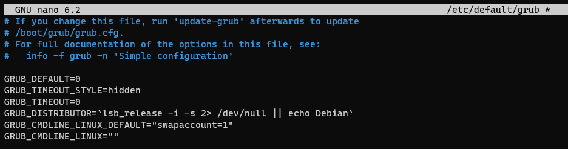

# How to install LXD

## About
This document describes how to install [LXD](https://linuxcontainers.org/) on Ubuntu Server 22.04.  

## Description
LXD (lex-dee) is the lightervisor, or lightweight container hypervisor.  
LXC (lex-see) is a program which creates and administers 'containers' on a local system. It also provides an API to allow higher level managers, such as LXD, to administer containers.

## Table of content
1. [Installation](#installation)
    1. [Update Ubuntu hosts](#update-ubuntu-hosts)
	2. [Kernel preparation](#kernel-preparation)
	3. [Configure firewall](#configure-firewall)
	4. [Install LXD](#install-lxd)
	5. [Grant accees to lxd group](#grant-accees-to-lxd-group)
	6. [Initialize LXD](#initialize-lxd)
	7. [Setup clustering](#setup-clustering)
	    1. [Method1: Adding node with trust password](#adding-node-with-trust-password)
		2. [Method2: Adding node with cluster add command](#adding-node-with-cluster-add-command)
		3. [Method3: Adding nodes noninteractively](#adding-nodes-noninteractively)
	8. [Authentication](#authentication)
2. [Common operations](#common-operations)
    1. [List nodes with lxd](#list-nodes-with-lxd)
	2. [List nodes with lxc](#list-nodes-with-lcx)
	3. [Restarting LXD](#restarting-lxd)
	4. [Creating a container](#creating-a-container)
	5. [Creating a container with limits](#creating-a-container-with-limits)
	6. [Interact with container](#interact-with-container)
	7. [Access files from the container](#access-files-from-the-container)
	8. [Snapshots](#snapshots)
	9. [Publishing images](#publishing-images)
	10. [Image export and import](#image-export-and-import)
	11. [Container configuration](#container-configuration)
	12. [Profiles](#profiles)
	13. [Nesting](#nesting)
	14. [Limits](#limits)
	15. [UID mappings and Privileged containers](#uid-mappings-and-privileged-containers)
	16. [Apparmor](#apparmor)
	17. [Seccomp](#seccomp)
	18. [Raw LXC configuration](#raw-lxc-configuration)
3. [Cleanup](#cleanup)
4. [Troubleshooting](#troubleshooting)
5. [Related links](#related-links)	

## Installation <a id="installation"></a>

### Update Ubuntu hosts <a id="update-ubuntu-hosts"></a>
First we'll make sure our Ubuntu hosts are up to date
```console
sudo apt-get update && sudo apt-get dist-upgrade
```

### Kernel preparation <a id="kernel-preparation"></a>
In general, Ubuntu should have all the desired features enabled by default. One exception to this is that in order to enable swap accounting the boot argument **swapaccount=1** must be set.  
This can be done by appending it to the **GRUB_CMDLINE_LINUX_DEFAULT=** variable in /etc/default/grub, then running 'update-grub' as root and rebooting.
```console
sudo nano /etc/default/grub
sudo update-grub
```



### Configure firewall <a id="configure-firewall"></a>
Enable ufw
```console
sudo ufw allow ssh
sudo ufw enable
```

You can follow the guide from the [official website](https://linuxcontainers.org/lxd/docs/master/howto/network_bridge_firewalld/#ufw-add-rules-for-the-bridge) to allow lxdfan0 traffic.
```console
sudo ufw allow in on lxdfan0
sudo ufw route allow in on lxdfan0
sudo ufw route allow out on lxdfan0
```

Or we can add more spesific rules.  
Add rules to ufw before.rules:
```console
sudo nano /etc/ufw/before.rules
```

Add the following rules before the COMMIT line.
```console
# Allow LXD Ports
# Input
-A ufw-before-input -i lxdfan0 -p icmp -m icmp --icmp-type 12 -m comment --comment "generated for LXD network lxdfan0" -j ACCEPT
-A ufw-before-input -i lxdfan0 -p icmp -m icmp --icmp-type 11 -m comment --comment "generated for LXD network lxdfan0" -j ACCEPT
-A ufw-before-input -i lxdfan0 -p icmp -m icmp --icmp-type 3 -m comment --comment "generated for LXD network lxdfan0" -j ACCEPT
-A ufw-before-input -i lxdfan0 -p tcp -m tcp --dport 53 -m comment --comment "generated for LXD network lxdfan0" -j ACCEPT
-A ufw-before-input -i lxdfan0 -p udp -m udp --dport 53 -m comment --comment "generated for LXD network lxdfan0" -j ACCEPT
-A ufw-before-input -i lxdfan0 -p udp -m udp --dport 67 -m comment --comment "generated for LXD network lxdfan0" -j ACCEPT
-A ufw-before-input -i eth0 -p tcp -m tcp --dport 8443 -m comment --comment "generated for LXD network eth0" -j ACCEPT
# Forward
-A ufw-before-forward -o lxdfan0 -m comment --comment "generated for LXD network lxdfan0" -j ACCEPT
-A ufw-before-forward -i lxdfan0 -m comment --comment "generated for LXD network lxdfan0" -j ACCEPT
# Output
-A ufw-before-output -o lxdfan0 -p icmp -m icmp --icmp-type 12 -m comment --comment "generated for LXD network lxdfan0" -j ACCEPT
-A ufw-before-output -o lxdfan0 -p icmp -m icmp --icmp-type 11 -m comment --comment "generated for LXD network lxdfan0" -j ACCEPT
-A ufw-before-output -o lxdfan0 -p icmp -m icmp --icmp-type 3 -m comment --comment "generated for LXD network lxdfan0" -j ACCEPT
-A ufw-before-output -o lxdfan0 -p tcp -m tcp --sport 53 -m comment --comment "generated for LXD network lxdfan0" -j ACCEPT
-A ufw-before-output -o lxdfan0 -p udp -m udp --sport 53 -m comment --comment "generated for LXD network lxdfan0" -j ACCEPT
-A ufw-before-output -o lxdfan0 -p udp -m udp --sport 67 -m comment --comment "generated for LXD network lxdfan0" -j ACCEPT
```

For IPv6 support:
```console
sudo nano /etc/ufw/before6.rules
```

Add the following rules before the COMMIT line.
```console
# Allow LXD Ports
# Input
-A ufw6-before-input -i lxdfan0 -p ipv6-icmp -m icmp6 --icmpv6-type 143 -m comment --comment "generated for LXD network lxdfan0" -j ACCEPT
-A ufw6-before-input -i lxdfan0 -p ipv6-icmp -m icmp6 --icmpv6-type 136 -m comment --comment "generated for LXD network lxdfan0" -j ACCEPT
-A ufw6-before-input -i lxdfan0 -p ipv6-icmp -m icmp6 --icmpv6-type 135 -m comment --comment "generated for LXD network lxdfan0" -j ACCEPT
-A ufw6-before-input -i lxdfan0 -p ipv6-icmp -m icmp6 --icmpv6-type 133 -m comment --comment "generated for LXD network lxdfan0" -j ACCEPT
-A ufw6-before-input -i lxdfan0 -p ipv6-icmp -m icmp6 --icmpv6-type 4 -m comment --comment "generated for LXD network lxdfan0" -j ACCEPT
-A ufw6-before-input -i lxdfan0 -p ipv6-icmp -m icmp6 --icmpv6-type 3 -m comment --comment "generated for LXD network lxdfan0" -j ACCEPT
-A ufw6-before-input -i lxdfan0 -p ipv6-icmp -m icmp6 --icmpv6-type 2 -m comment --comment "generated for LXD network lxdfan0" -j ACCEPT
-A ufw6-before-input -i lxdfan0 -p ipv6-icmp -m icmp6 --icmpv6-type 1 -m comment --comment "generated for LXD network lxdfan0" -j ACCEPT
-A ufw6-before-input -i lxdfan0 -p tcp -m tcp --dport 53 -m comment --comment "generated for LXD network lxdfan0" -j ACCEPT
-A ufw6-before-input -i lxdfan0 -p udp -m udp --dport 53 -m comment --comment "generated for LXD network lxdfan0" -j ACCEPT
-A ufw6-before-input -i lxdfan0 -p udp -m udp --dport 547 -m comment --comment "generated for LXD network lxdfan0" -j ACCEPT
-A ufw6-before-input -i eth0 -p tcp -m tcp --dport 8443 -m comment --comment "generated for LXD network eth0" -j ACCEPT
# Forward
-A ufw6-before-forward -o lxdfan0 -m comment --comment "generated for LXD network lxdfan0" -j ACCEPT
-A ufw6-before-forward -i lxdfan0 -m comment --comment "generated for LXD network lxdfan0" -j ACCEPT
# Output
-A ufw6-before-output -o lxdfan0 -p ipv6-icmp -m icmp6 --icmpv6-type 143 -m comment --comment "generated for LXD network lxdfan0" -j ACCEPT
-A ufw6-before-output -o lxdfan0 -p ipv6-icmp -m icmp6 --icmpv6-type 136 -m comment --comment "generated for LXD network lxdfan0" -j ACCEPT
-A ufw6-before-output -o lxdfan0 -p ipv6-icmp -m icmp6 --icmpv6-type 135 -m comment --comment "generated for LXD network lxdfan0" -j ACCEPT
-A ufw6-before-output -o lxdfan0 -p ipv6-icmp -m icmp6 --icmpv6-type 134 -m comment --comment "generated for LXD network lxdfan0" -j ACCEPT
-A ufw6-before-output -o lxdfan0 -p ipv6-icmp -m icmp6 --icmpv6-type 128 -m comment --comment "generated for LXD network lxdfan0" -j ACCEPT
-A ufw6-before-output -o lxdfan0 -p ipv6-icmp -m icmp6 --icmpv6-type 4 -m comment --comment "generated for LXD network lxdfan0" -j ACCEPT
-A ufw6-before-output -o lxdfan0 -p ipv6-icmp -m icmp6 --icmpv6-type 3 -m comment --comment "generated for LXD network lxdfan0" -j ACCEPT
-A ufw6-before-output -o lxdfan0 -p ipv6-icmp -m icmp6 --icmpv6-type 2 -m comment --comment "generated for LXD network lxdfan0" -j ACCEPT
-A ufw6-before-output -o lxdfan0 -p ipv6-icmp -m icmp6 --icmpv6-type 1 -m comment --comment "generated for LXD network lxdfan0" -j ACCEPT
-A ufw6-before-output -o lxdfan0 -p tcp -m tcp --sport 53 -m comment --comment "generated for LXD network lxdfan0" -j ACCEPT
-A ufw6-before-output -o lxdfan0 -p udp -m udp --sport 53 -m comment --comment "generated for LXD network lxdfan0" -j ACCEPT
-A ufw6-before-output -o lxdfan0 -p udp -m udp --sport 547 -m comment --comment "generated for LXD network lxdfan0" -j ACCEPT
```

Restart firewall to apply settings:
```console
sudo ufw disable && sudo ufw enable
```

### Install LXD <a id="install-lxd"></a>
LXD can be installed via snap.  
If you dont have snap command, see [Installing snapd](https://snapcraft.io/docs/installing-snapd)  

LXD is pre-installed on Ubuntu Server. On other systems, the lxd package can be installed using:
```console
sudo snap install lxd
```

For the LXD 5.0 LTS release, use:
```console
sudo snap install lxd --channel=5.0/stable
```

### Grant accees to lxd group <a id="grant-accees-to-lxd-group"></a>
You must run 'lxd init' as root. 'lxc' commands can be run as any user who is a member of group lxd.

Access control for LXD is based on group membership. The root user and all members of the lxd group can interact with the local daemon.  
The user that installed the LXD snap will already be added. Other users can be added with:
```console
sudo adduser $USER lxd
newgrp lxd
```

If the lxd group is missing on your system, create it and restart the LXD daemon. You can then add trusted users to the group. Anyone added to this group will have full control over LXD.

> :warning: **Caution:** Anyone with access to the LXD socket can fully control LXD, which includes the ability to attach host devices and file systems. 
> Therefore, you should only give access to users who would be trusted with root access to the host.
>
> You can learn more about LXD security [here](https://linuxcontainers.org/lxd/docs/latest/security).

### Initialize LXD <a id="initialize-lxd"></a>
LXD provides an interactive dialogue to configure your local cloud during the initialization procedure
```console
sudo lxd init
```

The init script itself may vary depending on the version of LXD. You can use most default options in the dialogue. The important configuration options are:  
- LXD clustering: Enable if installation is to be clustered
- IP: Make sure to use an IP or DNS address that other servers can reach
- Password authentication: Select no to use authentication tokens (recommended) or yes to use a trust password
- Storage Pool: The recommended and the default backing store is 'zfs', but we will use the 'dir' storage type
- Networking: We will use the default fan overlay

```console
bee@lxdn1:~$ sudo lxd init
Would you like to use LXD clustering? (yes/no) [default=no]: yes
What IP address or DNS name should be used to reach this node? [default=192.168.0.229]:
Are you joining an existing cluster? (yes/no) [default=no]: no
What name should be used to identify this node in the cluster? [default=lxdn1]:
Setup password authentication on the cluster? (yes/no) [default=no]:
Do you want to configure a new local storage pool? (yes/no) [default=yes]:
Name of the storage backend to use (btrfs, dir, lvm, zfs) [default=zfs]: dir
Do you want to configure a new remote storage pool? (yes/no) [default=no]:
Would you like to connect to a MAAS server? (yes/no) [default=no]:
Would you like to configure LXD to use an existing bridge or host interface? (yes/no) [default=no]:
Would you like to create a new Fan overlay network? (yes/no) [default=yes]:
What subnet should be used as the Fan underlay? [default=auto]:
Would you like stale cached images to be updated automatically? (yes/no) [default=yes]:
Would you like a YAML "lxd init" preseed to be printed? (yes/no) [default=no]:
```

Maybe need to disabled LXDs firewall functionality since we use UFW
```console
lxc network set lxdfan0 ipv6.firewall false
lxc network set lxdfan0 ipv4.firewall false
```

If you wish to disable IPv6:
```console
lxc network set lxdfan0 ipv6.address none
```

### Setup clustering <a id="setup-clustering"></a>
LXD can be run in clustering mode, where any number of LXD servers share the same distributed database and can be managed uniformly using the lxc client or the REST API. 
A LXD cluster consists of one bootstrap server and at least two further cluster members. It stores its state in 
a [distributed database](https://linuxcontainers.org/lxd/docs/stable-5.0/database/), which is a [Dqlite](https://dqlite.io/) database replicated using the Raft algorithm.

Note that all further nodes joining the cluster must have identical configuration to the bootstrap node, in terms of storage pools and networks. The only configuration that can be 
node-specific are the **source** and **size** keys for storage pools and the **bridge.external_interfaces** key for networks.  

It is strongly recommended that the number of nodes in the cluster be at least three, so the cluster can survive the loss of at least one node and still be able to establish quorum 
for its distributed state (which is kept in a SQLite database replicated using the Raft algorithm). If the number of nodes is less than three, then only one node in the cluster will 
store the SQLite database. When the third node joins the cluster, both the second and third nodes will receive a replica of the database.  

In a cluster with three members, all members replicate the distributed database that stores the state of the cluster. If the cluster has more members, only some of them replicate 
the database. The remaining members have access to the database, but don’t replicate it.  

Each member that replicates the database has either the role of a voter or of a stand-by. If the cluster leader goes offline, one of the voters is elected as the new leader. 
If a voter member goes offline, a stand-by member is automatically promoted to voter. The database (and hence the cluster) remains available as long as a majority of voters is online.  

The default number of voter members (**cluster.max_voters**) is three. The default number of stand-by members (**cluster.max_standby**) is two. With this configuration, your cluster will 
remain operational as long as you switch off at most one voting member at a time.  

There are two ways to add a member to an existing cluster; using the trust password or using a join token. Nodes can also be added noninteractively.  

#### Method1: Adding node with trust password <a id="adding-node-with-trust-password"></a>
The trust password can be set at initial configuration using **sudo lxd init**, or after the fact using:
```console
lxc config set core.trust_password PASSWORD
```

Then on each of the nodes, run **sudo lxd init** to add them to the cluster
```console
bee@lxdn3:~$ sudo lxd init
Would you like to use LXD clustering? (yes/no) [default=no]: yes
What IP address or DNS name should be used to reach this server? [default=192.168.0.205]:
Are you joining an existing cluster? (yes/no) [default=no]: yes
Do you have a join token? (yes/no/[token]) [default=no]: no
What member name should be used to identify this server in the cluster? [default=lxdn3]:
IP address or FQDN of an existing cluster member (may include port): 192.168.0.229
Cluster fingerprint: d05bce...
You can validate this fingerprint by running "lxc info" locally on an existing cluster member.
Is this the correct fingerprint? (yes/no/[fingerprint]) [default=no]: yes
Cluster trust password:
All existing data is lost when joining a cluster, continue? (yes/no) [default=no] yes
Choose "source" property for storage pool "local":
Would you like a YAML "lxd init" preseed to be printed? (yes/no) [default=no]:
```

#### Method2: Adding node with cluster add command <a id="adding-node-with-cluster-add-command"></a>
First add the nodes to the cluster on a node that is already a clustermember:
```console
lxc cluster add lxdn2
lxc cluster add lxdn3
```

This will generate and output the join token.  
Then on each of the nodes, run **sudo lxd init** to add them to the cluster
```console
sudo lxd init
```

```console
bee@lxdn3:~$ sudo lxd init
Would you like to use LXD clustering? (yes/no) [default=no]: yes
What IP address or DNS name should be used to reach this node? [default=192.168.0.205]:
Are you joining an existing cluster? (yes/no) [default=no]: yes
Do you have a join token? (yes/no/[token]) [default=no]: eyJzZXJ2....
All existing data is lost when joining a cluster, continue? (yes/no) [default=no] yes
Choose "source" property for storage pool "local":
Would you like a YAML "lxd init" preseed to be printed? (yes/no) [default=no]:
```

> :warning: **Caution:** On nodes joining the cluster, the lxd command has to be run with **sudo**.  

#### Method3: Adding nodes noninteractively <a id="adding-nodes-noninteractively"></a>
To add nodes noninteractively, you can create a preseed file for the bootstrap node with the configuration. 
See [LXD preeseed documentation](https://linuxcontainers.org/lxd/docs/stable-4.0/clustering/#preseed) for more information.

And then bootstrap the node with it:
```console
cat <preseed-file> | lxd init --preseed
```

Check syslog if there are connection problems between nodes
```console
cat /var/log/syslog
```

### Authentication <a id="authentication"></a>
By default, LXD will allow all members of group lxd to talk to it over the UNIX socket.  
Communication over the network is authorized using server and client certificates.  

Before client c1 wishes to use remote r1, r1 must be registered using:
```console
lxc remote add r1 r1.example.com:8443
```

The fingerprint of r1’s certificate will be shown, to allow the user at c1 to reject a false certificate. The server in turn will verify that c1 may be trusted in one of two ways.  
 
The first is to register it in advance from any already-registered client, using:
```console
lxc config trust add r1 certfile.crt
```

Now when the client adds r1 as a known remote, it will not need to provide a password as it is already trusted by the server.  

The other step is to configure a trust password with r1, either at initial configuration using **sudo lxd init**, or after the fact using:
```console
lxc config set core.trust_password PASSWORD
```

The password can then be provided when the client registers r1 as a known remote.

## Common operations <a id="common-operations"></a>
When all nodes are added to the cluster, we're ready to test the installation

### List nodes with lxd <a id="list-nodes-with-lxd"></a>
```console
bee@lxdn1:~$ sudo lxd cluster show
# Latest dqlite segment ID: 28

members:
- id: 1
  name: lxdn1
  address: 192.168.0.229:8443
  role: voter
- id: 2
  name: lxdn2
  address: 192.168.0.200:8443
  role: voter
- id: 3
  name: lxdn3
  address: 192.168.0.205:8443
  role: voter
```

### List nodes with lxc <a id="list-nodes-with-lcx"></a>
```console
bee@lxdn1:~$ lxc cluster list
+-------+----------------------------+-----------------+--------------+----------------+-------------+--------+-------------------+
| NAME  |            URL             |      ROLES      | ARCHITECTURE | FAILURE DOMAIN | DESCRIPTION | STATE  |      MESSAGE      |
+-------+----------------------------+-----------------+--------------+----------------+-------------+--------+-------------------+
| lxdn1 | https://192.168.0.229:8443 | database-leader | x86_64       | default        |             | ONLINE | Fully operational |
|       |                            | database        |              |                |             |        |                   |
+-------+----------------------------+-----------------+--------------+----------------+-------------+--------+-------------------+
| lxdn2 | https://192.168.0.200:8443 | database        | x86_64       | default        |             | ONLINE | Fully operational |
+-------+----------------------------+-----------------+--------------+----------------+-------------+--------+-------------------+
| lxdn3 | https://192.168.0.205:8443 | database        | x86_64       | default        |             | ONLINE | Fully operational |
+-------+----------------------------+-----------------+--------------+----------------+-------------+--------+-------------------+
```

More detailed information about an individual node is available with **lxc cluster show <node name>**.

### Restarting LXD <a id="restarting-lxd"></a>
Restarting LXD and all containers
```console
# Restart all containers
systemctl restart snap.lxd.daemon
```

Restarting only the LXD daemon/API
```console
# Restart only the daemon/API.
systemctl reload snap.lxd.daemon
```

### Creating a container <a id="creating-a-container"></a>
Every new container is created based on either an image, an existing container, or a container snapshot. At install time, LXD is configured with the following image servers:
- **ubuntu**: this serves official Ubuntu server cloud image releases.
- **ubuntu-daily**: this serves official Ubuntu server cloud images of the daily development releases.
- **images**: this is a default-installed alias for [images.linuxcontainers.org](http://images.linuxcontainers.org/). This is serves classical lxc images built using the same 
images which the LXC 'download' template uses. 
This includes various distributions and minimal custom-made Ubuntu images. This is not the recommended server for Ubuntu images.

The command to create and start a container is
```console
lxc launch remote:image containername
```

Images are identified by their hash, but are also aliased. The **ubuntu** remote knows many aliases such as **22.04** and **jammy**. 
A list of all images available from the Ubuntu image server can be seen using:
```console
lxc image list ubuntu:
```

That produces a whole lot of output. We can filter the search using the **lts** alias for the latest supported LTS release for **arm64** architecture:
```console
bee@lxdn3:~$ lxc image list ubuntu:lts/arm64
+------------------+--------------+--------+---------------------------------------------+--------------+-----------------+----------+-------------------------------+
|      ALIAS       | FINGERPRINT  | PUBLIC |                 DESCRIPTION                 | ARCHITECTURE |      TYPE       |   SIZE   |          UPLOAD DATE          |
+------------------+--------------+--------+---------------------------------------------+--------------+-----------------+----------+-------------------------------+
| j/arm64 (4 more) | 29177d43508f | yes    | ubuntu 22.04 LTS arm64 (release) (20230427) | aarch64      | VIRTUAL-MACHINE | 637.19MB | Apr 27, 2023 at 12:00am (UTC) |
+------------------+--------------+--------+---------------------------------------------+--------------+-----------------+----------+-------------------------------+
| j/arm64 (4 more) | dcaf042e459d | yes    | ubuntu 22.04 LTS arm64 (release) (20230427) | aarch64      | CONTAINER       | 418.04MB | Apr 27, 2023 at 12:00am (UTC) |
+------------------+--------------+--------+---------------------------------------------+--------------+-----------------+----------+-------------------------------+
```

To see more information about a particular image, including all the aliases it is known by, you can use:
```console
bee@lxdn3:~$ lxc image info ubuntu:lts/arm64
Fingerprint: dcaf042e459d12327b515688da85c27f05aa3b8f6c925af0e5f97be7a1725d53
Size: 418.04MB
Architecture: aarch64
Type: container
Public: yes
Timestamps:
    Created: 2023/04/27 00:00 UTC
    Uploaded: 2023/04/27 00:00 UTC
    Expires: 2027/06/01 00:00 UTC
    Last used: never
Properties:
    os: ubuntu
    release: jammy
    version: 22.04
    architecture: arm64
    label: release
    serial: 20230427
    description: ubuntu 22.04 LTS arm64 (release) (20230427)
    type: squashfs
Aliases:
    - 22.04/arm64
    - j/arm64
    - jammy/arm64
    - lts/arm64
    - default/arm64
Cached: no
Auto update: disabled
Profiles: []
```

Let’s start our first container:
```console
bee@lxdn1:~$ lxc launch ubuntu:jammy j1
Creating j1
Starting j1
```

This will download the official current Jammy cloud image for your current architecture, then create a container named j1 using that image, and finally start it. 
Note that launching this container takes a few seconds, because the image must be downloaded and unpacked first. Once the command returns, you can see it using:
```console
bee@lxdn1:~$ lxc list
+------+---------+----------------------+------+-----------+-----------+----------+
| NAME |  STATE  |         IPV4         | IPV6 |   TYPE    | SNAPSHOTS | LOCATION |
+------+---------+----------------------+------+-----------+-----------+----------+
| j1   | RUNNING | 240.229.0.195 (eth0) |      | CONTAINER | 0         |  lxdn1   |
+------+---------+----------------------+------+-----------+-----------+----------+

bee@lxdn1:~$ lxc info j1
Name: j1
Status: RUNNING
Type: container
Architecture: x86_64
Location: lxdn1
PID: 3217
Created: 2023/04/30 19:50 UTC
Last Used: 2023/04/30 19:51 UTC

Resources:
  Processes: 53
  CPU usage:
    CPU usage (in seconds): 20
  Memory usage:
    Memory (current): 281.48MiB
    Swap (current): 20.00KiB
  Network usage:
    eth0:
      Type: broadcast
      State: UP
      Host interface: vethcabe6871
      MAC address: 00:16:3e:ea:20:d2
      MTU: 1450
      Bytes received: 260.73kB
      Bytes sent: 12.01kB
      Packets received: 90
      Packets sent: 84
      IP addresses:
        inet:  240.229.0.195/8 (global)
        inet6: fe80::216:3eff:feea:20d2/64 (link)
    lo:
      Type: loopback
      State: UP
      MTU: 65536
      Bytes received: 1.60kB
      Bytes sent: 1.60kB
      Packets received: 19
      Packets sent: 19
      IP addresses:
        inet:  127.0.0.1/8 (local)
        inet6: ::1/128 (local)
```

And open a shell in it using:
```console
bee@lxdn1:~$ lxc exec j1 -- bash
root@j1:~# uname -a
Linux j1 5.15.0-71-generic #78-Ubuntu SMP Tue Apr 18 09:00:29 UTC 2023 x86_64 x86_64 x86_64 GNU/Linux
root@j1:~# exit
exit
```

A convenient alias for the command above is:
```console
lxc shell j1
```

Now that the Jammy image has been downloaded, it will be kept in sync until no new containers have been created based on it for (by default) 10 days. After that, it will be deleted.  

Start a second container:
```console
bee@lxdn1:~$ lxc launch ubuntu:jammy j2
Creating j2
Starting j2
```

Launching this container is quicker than launching the first, because the image is already available.

Copy the j1 container into a container called j3:
```console
lxc copy j1 j3
```

> :warning: **Note:** Live migrations will fail if CRIU is not installed.  
```console
bee@lxdn1:~$ lxc copy j1 j3
Error: Unable to perform live container migration. CRIU isn't installed on the source server. To migrate the container, stop the container before migration or install CRIU on the source server
```

Install CRIU, or stop the container before copying:
```console
bee@lxdn1:~$ lxc stop j1
bee@lxdn1:~$ lxc copy j1 j3
bee@lxdn1:~$ lxc start j1
```

Check the list of containers that you launched:
```console
bee@lxd1:~$ lxc list
+------+---------+----------------------+------+-----------+-----------+----------+
| NAME |  STATE  |         IPV4         | IPV6 |   TYPE    | SNAPSHOTS | LOCATION |
+------+---------+----------------------+------+-----------+-----------+----------+
| j1   | RUNNING | 240.229.0.195 (eth0) |      | CONTAINER | 0         |  lxdn1   |
+------+---------+----------------------+------+-----------+-----------+----------+
| j2   | RUNNING | 240.200.0.28 (eth0)  |      | CONTAINER | 0         |  lxdn2   |
+------+---------+----------------------+------+-----------+-----------+----------+
| j3   | STOPPED |                      |      | CONTAINER | 0         |  lxdn3   |
+------+---------+----------------------+------+-----------+-----------+----------+
```

You will see that all but the third container are running. This is because you created the third container by copying the first, but you didn't start it.  
You can start the third container with:
```console
lxc start j3
```

You can query more information about each container with:
```console
lxc info j1
lxc info j2
lxc info j3
```

Stop the j2 container:
```console
lxc stop j2
```

Delete the j2 container:
```console
lxc delete j2
```

Delete the j3 container:
```console
bee@lxdn1:~$ lxc delete j3
Error: The instance is currently running, stop it first or pass --force
```

Since this container is running, you get an error message that you must stop it first. Alternatively, you can force-delete it:
```console
lxc delete j3 --force
```

### Creating a container with limits <a id="creating-a-container-with-limits"></a>
There are several limits and configuration options that you can set for your instances. 
See [Instance configuration](https://linuxcontainers.org/lxd/docs/master/instances) for an overview.

Let's create another container with some resource limits.  

Launch a container and limit it to one vCPU and 192 MiB of RAM:
```console
lxc launch images:ubuntu/20.04 limitedc1 -c limits.cpu=1 -c limits.memory=192MiB
```

Check the current configuration and compare it to the configuration of the first (unlimited) container:
```console
lxc config show limitedc1
lxc config show j1
```

Check the amount of free and used memory on the parent system and on the two containers:
```console
bee@lxdn1:~$ free -m
               total        used        free      shared  buff/cache   available
Mem:            2035          70        1763           0         201        1964
Swap:              0           0           0
bee@lxdn1:~$ lxc exec j1 -- free -m
               total        used        free      shared  buff/cache   available
Mem:            2035          70        1763           0         201        1964
Swap:              0           0           0
bee@lxdn1:~$ lxc exec limitedc1 -- free -m
              total        used        free      shared  buff/cache   available
Mem:            192          70         122           0          30         162
Swap:             0           0           0
```

Note that the total amount of memory is identical for the parent system and the first container, because by default, 
the container inherits the resources from its parent environment. The limited container, on the other hand, has only 192 MiB available.

Check the number of CPUs available on the parent system and on the two containers:
```console
bee@lxdn1:~$ nproc
28
bee@lxdn1:~$ lxc exec j1 -- nproc
28
bee@lxdn1:~$ lxc exec limitedc1 -- nproc
1
```

Again, note that the number is identical for the parent system and the first container, but reduced for the limited container.  

You can also update the configuration while your container is running.  
Configure a memory limit for your container:
```console
lxc config set limitedc1 limits.memory=128MiB
```

Check that the configuration has been applied:
```console
lxc config show limitedc1
```

Check the amount of memory that is available to the container:
```console
bee@lxdn1:~$ lxc exec limitedc1 -- free -m
              total        used        free      shared  buff/cache   available
Mem:            128          27          73           0          27         100
Swap:             0           0           0
```

Note that the number has changed.

### Interact with container <a id="interact-with-container"></a>
Launch an interactive shell in your container:
```console
bee@lxdn1:~$ lxc exec j1 -- bash
root@j1:~#
```

Enter some commands, for example, display information about the operating system:
```console
cat /etc/*release | grep CODENAME
```

Exit the interactive shell:
```console
bee@lxdn1:~$ lxc exec j1 -- bash
root@j1:~# cat /etc/*release | grep CODENAME
DISTRIB_CODENAME=jammy
VERSION_CODENAME=jammy
UBUNTU_CODENAME=jammy
root@j1:~# exit
exit
```

Instead of logging on to the container and running commands there, you can run commands directly from the host. For example, 
you can install a command line tool on the container and run it:
```console
lxc exec j1 -- apt-get update
lxc exec j1 -- apt-get install sl -y
lxc exec j1 -- /usr/games/sl
```

### Access files from the container <a id="access-files-from-the-container"></a>
Pull a file from the container:
```console
lxc file pull j1/etc/hosts .
```

Add an entry to the file:
```console
echo "1.2.3.4 my-example" >> hosts
```

Push the file back to the container:
```console
lxc file push hosts j1/etc/hosts
```

Use the same mechanism to access log files:
```console
lxc file pull j1/var/log/syslog - | less
q
```

### Snapshots <a id="snapshots"></a>
LXD supports creating and restoring container snapshots.  
Create a snapshot called 'clean':
```console
lxc snapshot j1 clean
```

Confirm that the snapshot has been created:
```console
bee@lxdn1:~$ lxc list j1
+------+---------+----------------------+------+-----------+-----------+----------+
| NAME |  STATE  |         IPV4         | IPV6 |   TYPE    | SNAPSHOTS | LOCATION |
+------+---------+----------------------+------+-----------+-----------+----------+
| j1   | RUNNING | 240.229.0.195 (eth0) |      | CONTAINER | 1         |  lxdn1   |
+------+---------+----------------------+------+-----------+-----------+----------+

bee@lxdn1:~$ lxc info j1
Name: j1
Status: RUNNING
<snipp>

Snapshots:
+-------+----------------------+------------+----------+
| NAME  |       TAKEN AT       | EXPIRES AT | STATEFUL |
+-------+----------------------+------------+----------+
| clean | 2023/04/30 20:21 UTC |            | NO       |
+-------+----------------------+------------+----------+
```

**lxc list** shows the number of snapshots.  
**lxc info** displays information about each snapshot.

Break the container:
```console
lxc exec j1 -- rm -Rf /etc /usr
```

Confirm the breakage:
```console
bee@lxdn1:~$ lxc exec j1 -- bash
Error: Command not found
```

Note that you do not get a shell, because you deleted the **bash** command

Restore the container to the snapshotted state:
```console
lxc restore j1 clean
```

Confirm that everything is back to normal:
```console
bee@lxdn1:~$ lxc exec j1 -- bash
root@j1:~# exit
exit
```

New containers can also be created by copying a container or snapshot:
```console
lxc copy j1/clean j4
```

Deleting the snapshot is done with:
```console
lxc delete j1/clean
```

but we will keep it for now. 

To list snapshots install jq:
```console
bee@lxdn1:~$ sudo snap install jq
jq 1.5+dfsg-1 from Michael Vogt (mvo✪) installed
```

We can then list snapshotswith this command:
```console
bee@lxdn1:~$ for k in $(lxc ls -c"n" -fcsv) ; do curl -s --unix-socket /var/snap/lxd/common/lxd/unix.socket a/1.0/instances/$k/snapshots? | jq .metadata[]; done
"/1.0/instances/j1/snapshots/clean"
```

### Publishing images <a id="publishing-images"></a>
When a container or container snapshot is ready for consumption by others, it can be published as a new image using:
```console
lxc publish j1/clean --alias jellyfoo-2.0
```

The published image will be private by default, meaning that LXD will not allow clients without a trusted certificate to see them. 
If the image is safe for public viewing (i.e. contains no private information), then the 'public' flag can be set, either at publish time using
```console
lxc publish j1/clean --alias jellyfoo-2.0 public=true
```

or after the fact using to change the value of the public field:
```console
lxc image edit jellyfoo-2.0
```

### Image export and import <a id="image-export-and-import"></a>
Image can be exported as, and imported from, tarballs:
```console
lxc image export jellyfoo-2.0 jellyfoo-2.0.tar.gz
lxc image import jellyfoo-2.0.tar.gz --alias jellyfoo-2.0 --public
```

### Container configuration <a id="container-configuration"></a>
Containers are configured according to a set of profiles, described in the next section, and a set of container-specific configuration. 
Profiles are applied first, so that container specific configuration can override profile configuration.  

Container configuration includes properties like the architecture, limits on resources such as CPU and RAM, security details including apparmor 
restriction overrides, and devices to apply to the container.  

Devices can be of several types, including UNIX character, UNIX block, network interface, or disk. In order to insert a host mount into a container, 
a 'disk' device type would be used. For instance, to mount **/opt** in container **j1** at **/opt**, you could use:
```console
lxc config device add j1 opt disk source=/opt path=opt
```

See:
```console
lxc help config
```

for more information about editing container configurations. You may also use:
```console
lxc config edit j1
```

to edit the whole of c1’s configuration. Comments at the top of the configuration will show examples of correct syntax to help administrators hit the ground running. 
If the edited configuration is not valid when the editor is exited, then the editor will be restarted.

### Profiles <a id="profiles"></a>
Profiles are named collections of configurations which may be applied to more than one container. For instance, all containers created with **lxc launch**, by default, 
include the **default** profile, which provides a network interface **eth0**.  

To mask a device which would be inherited from a profile but which should not be in the final container, define a device by the same name but of type 'none':
```console
# Note: This was eth1 in official docs
lxc config device add j1 eth0 none
```

### Nesting <a id="nesting"></a>
Containers all share the same host kernel. This means that there is always an inherent trade-off between features exposed to the container and host security from malicious containers. 
Containers by default are therefore restricted from features needed to nest child containers. In order to run lxc or lxd containers under a lxd container, 
the **security.nesting** feature must be set to true:
```console
lxc config set j1 security.nesting true
```

Once this is done, container **j1** will be able to start sub-containers.  

In order to run unprivileged (the default in LXD) containers nested under an unprivileged container, you will need to ensure a wide enough UID mapping. 
Please see the 'UID mapping' section below.

### Limits <a id="limits"></a>
LXD supports flexible constraints on the resources which containers can consume. The limits come in the following categories:
- **CPU**: limit cpu available to the container in several ways.
- **Disk**: configure the priority of I/O requests under load
- **RAM**: configure memory and swap availability
- **Network**: configure the network priority under load
- **Processes**: limit the number of concurrent processes in the container.

For a full list of limits known to LXD, see the [configuration documentation](https://linuxcontainers.org/lxd/docs/latest/reference/instance_options/#instance-options-limits).

### UID mappings and Privileged containers <a id="uid-mappings-and-privileged-containers"></a>
By default, LXD creates unprivileged containers. This means that root in the container is a non-root UID on the host. It is privileged against the resources owned by the container, 
but unprivileged with respect to the host, making root in a container roughly equivalent to an unprivileged user on the host. (The main exception is the increased attack surface 
exposed through the system call interface)  

Briefly, in an unprivileged container, 65536 UIDs are 'shifted' into the container. For instance, UID 0 in the container may be 100000 on the host, UID 1 in the container is 100001, 
etc, up to 165535. The starting value for UIDs and GIDs, respectively, is determined by the 'root' entry the **/etc/subuid** and **/etc/subgid** files. (See 
the [subuid(5)](http://manpages.ubuntu.com/manpages/xenial/en/man5/subuid.5.html?_ga=2.267011018.572322171.1682805927-2083364030.1682106307) man page.)  

It is possible to request a container to run without a UID mapping by setting the security.privileged flag to true:
```console
lxc config set j1 security.privileged true
```

> :warning: **Caution:** Note however that in this case the root user in the container is the root user on the host.

### Apparmor <a id="apparmor"></a>
XD confines containers by default with an apparmor profile which protects containers from each other and the host from containers. For instance this will prevent root in one container 
from signaling root in another container, even though they have the same uid mapping. It also prevents writing to dangerous, un-namespaced files such as many sysctls 
and **/proc/sysrq-trigger**.  

If the apparmor policy for a container needs to be modified for a container **j1**, specific apparmor policy lines can be added in the **raw.apparmor** configuration key.

### Seccomp <a id="seccomp"></a>
All containers are confined by a default seccomp policy. This policy prevents some dangerous actions such as forced umounts, kernel module loading and unloading, kexec, and 
the **open_by_handle_at system call**. The seccomp configuration cannot be modified, however a completely different seccomp policy – or none – can be requested 
using **raw.lxc** (see below).

### Raw LXC configuration <a id="raw-lxc-configuration"></a>
LXD configures containers for the best balance of host safety and container usability. Whenever possible it is highly recommended to use the defaults, and use the LXD configuration 
keys to request LXD to modify as needed. Sometimes, however, it may be necessary to talk to the underlying lxc driver itself. This can be done by specifying LXC configuration items 
in the 'raw.lxc' LXD configuration key. These must be valid items as documented in 
the [lxc.container.conf(5)](http://manpages.ubuntu.com/manpages/focal/en/man5/lxc.container.conf.5.html?_ga=2.262753992.572322171.1682805927-2083364030.1682106307) man page.

## Cleanup <a id="cleanup"></a>
To cleanup the testimages run:
```console
# Cleanup
lxc list
lxc stop j1
lxc stop limitedc1
lxc delete j1
lxc delete j4
lxc delete limitedc1
```

Delete snapshots:
```console
for k in $(lxc ls -c"n" -fcsv) ; do curl -s --unix-socket /var/snap/lxd/common/lxd/unix.socket a/1.0/instances/$k/snapshots? | jq .metadata[]; done
```

Delete exported images:
```console
ll ~
rm ~/jellyfoo-2.0.tar.gz.tar.gz
rm ~/hosts
```

Delete published images:
```console
lxc image list
lxc image delete jellyfoo-2.0
```

## Troubleshooting <a id="troubleshooting"></a>
To view debug information about LXD itself, on a systemd based host use:
```console
journalctl -u lxd
```

Container logfiles for container j1 may be seen using:
```console
lxc info j1 --show-log
```

The configuration file which was used may be found under  
**/var/log/lxd/j1/lxc.conf** while apparmor profiles can be found in  
**/var/lib/lxd/security/apparmor/profiles/j1** and seccomp profiles in  
**/var/lib/lxd/security/seccomp/j1**.  

## Related links <a id="related-links"></a>
[Installing snapd - snapcraft.io](https://snapcraft.io/docs/installing-snapd)  
[Containers LXD - ubuntu.com](https://ubuntu.com/server/docs/containers-lxd)  
[LXD Docs - linuxcontainers.org](https://linuxcontainers.org/lxd/docs/stable-5.0/#)
Yo, Tailor tell us what you want, what you really, really want. So tell us what you want, what you really, really want