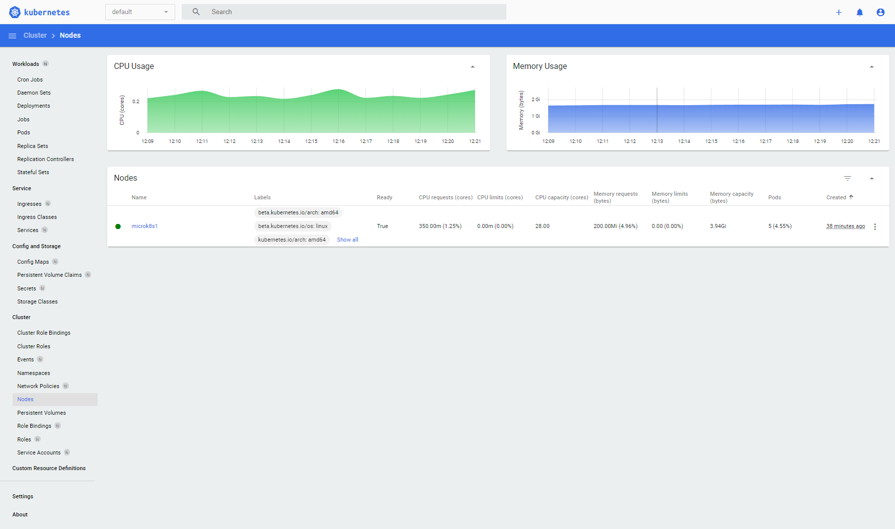

# How to install MicroK8s

## About
This document describes how to install MicroK8s.  
MicroK8s can run on many platforms and hardware. We will use Ubuntu Server 22.04.  

## Installation

### Update Ubuntu hosts
First we'll make sure our Ubuntu hosts are up to date  
```console
sudo apt-get update
sudo apt-get dist-upgrade
```

### Install MicroK8s
We'll use snap to install MicroK8s.  
If you dont have snap command, see [Installing snapd](https://snapcraft.io/docs/installing-snapd)
```console
sudo snap install microk8s --classic
```

### Grant accees to MicroK8s group and start Kubernetes
Add our user to the MicroK8s group
```console
sudo usermod -a -G microk8s $USER
newgrp microk8s
```

Checking the status while Kubernetes starts
```console
microk8s status --wait-ready
sudo chown -R $USER ~/.kube
```

Turning on the services you want
```console
microk8s enable dashboard dns registry istio
```

List availiable services and optional features
```console
microk8s enable --help
```

Turn off services
```console
microk8s disable <name>
```

Use this token in the https login UI of the kubernetes-dashboard service  
```console
microk8s kubectl describe secret -n kube-system microk8s-dashboard-token
```

### Start using Kubernetes
```console
microk8s kubectl get all --all-namespaces
```

Create an alias for microk8s kubectl to make life easier  
```console
alias mkctl="microk8s kubectl"
```
Since microk8s is a standard upstream kubectl, you can also drive other Kubernetes clusters with it by pointing to the respective kubeconfig file via the --kubeconfig argument.  

### Access the Kubernetes dashboard
```console
microk8s dashboard-proxy
```



### Start and stop Kubernetes
Kubernetes is a collection of system services that talk to each other all the time.  
If you don’t need them running in the background then you will save power by stopping them.  
```console
microk8s stop
```

To start them again
```console
microk8s start
```

## Related links
[Installing snapd - snapcraft.io](https://snapcraft.io/docs/installing-snapd)  
[Install Kubernetes - ubuntu.com](https://ubuntu.com/kubernetes/install)  
