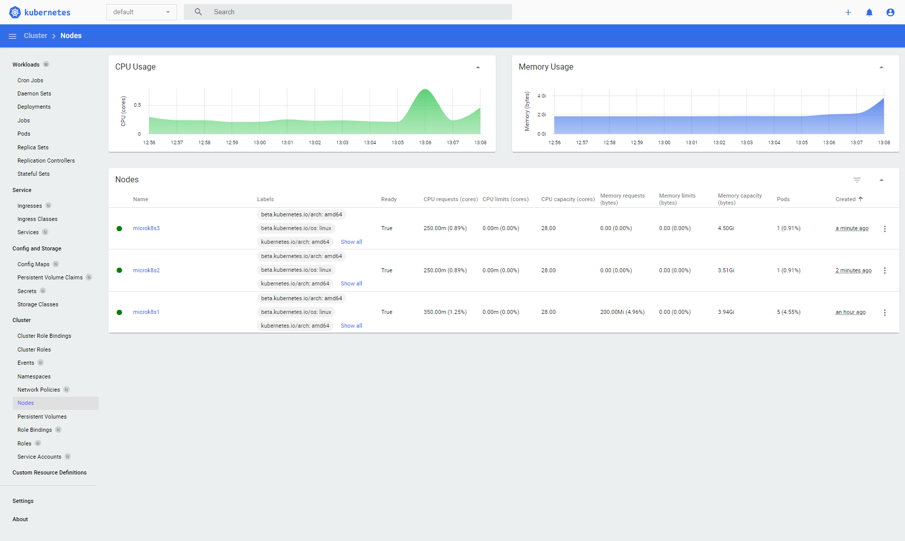

# How to setup multi-node, highly avilable Kubernetes with MicroK8s

## About
This document describes how to setup a multi-node, highly avilable Kubernetes with MicroK8s.  

## Installation

### Install MicroK8s nodes
Install 3 or more MicroK8s nodes.  
See [MicroK8s-HowtoInstall](MicroK8s-HowtoInstall.md)  

### Add nodes
To create a cluster out of two or more already-running MicroK8s instances, use the microk8s add-node command.  
As of MicroK8s 1.19, clustering of three or more nodes will automatically enable high availability.  

On the first MicroK8s instance run the add-node command. This node with host the Kubernetes control plane.
```console
microk8s add-node
```

If you dont have working dns, add all the nodes to the hosts file
```console
sudo nano /etc/hosts
```


The add-node command prints a microk8s join command which should be executed on the MicroK8s instance(s) that you wish to join to the cluster.  
Example of join command:
```console
microk8s join 192.168.0.224:25000/9d7f73e7216c33e565b3b2606fceacbc/af54644e6d6d
```

If you want to join a node as a worker not running the control plane, add the '--worker' flag
```console
microk8s join 192.168.0.224:25000/9d7f73e7216c33e565b3b2606fceacbc/af54644e6d6d --worker
```


Run this command on all the other MicroK8s nodes.  
Joining a node to the cluster should only take a few seconds. Afterwards you should be able to see the node has joined:
```console
microk8s kubectl get no
```

Or  with our alias command
```console
mkctl get no
```

```console
beelazy@microk8s1:~$ mkctl get no
NAME        STATUS   ROLES    AGE   VERSION
microk8s1   Ready    <none>   84m   v1.26.3
microk8s2   Ready    <none>   87s   v1.26.3
microk8s3   Ready    <none>   17s   v1.26.3
```



## Related links
[MicroK8s-HowtoInstall](MicroK8s-HowtoInstall.md)  
[Install Kubernetes - ubuntu.com](https://ubuntu.com/kubernetes/install)  
