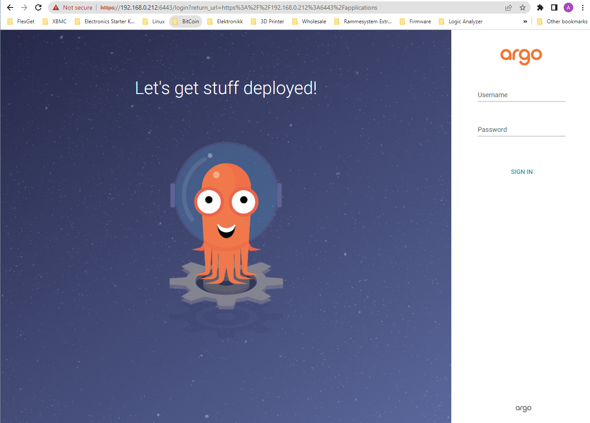
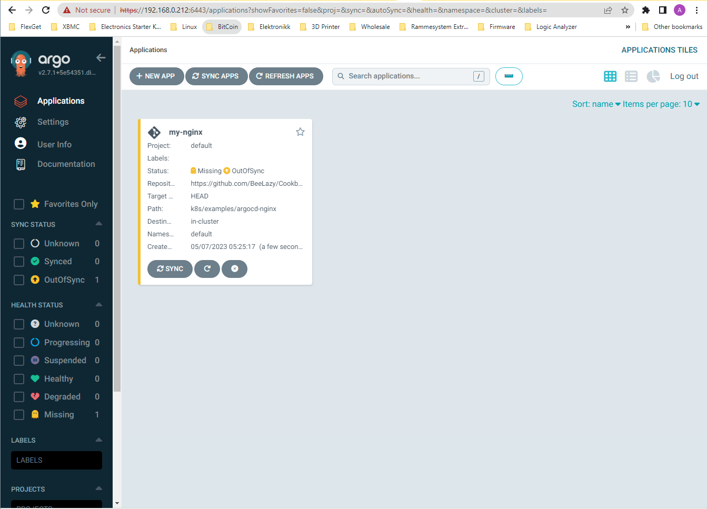
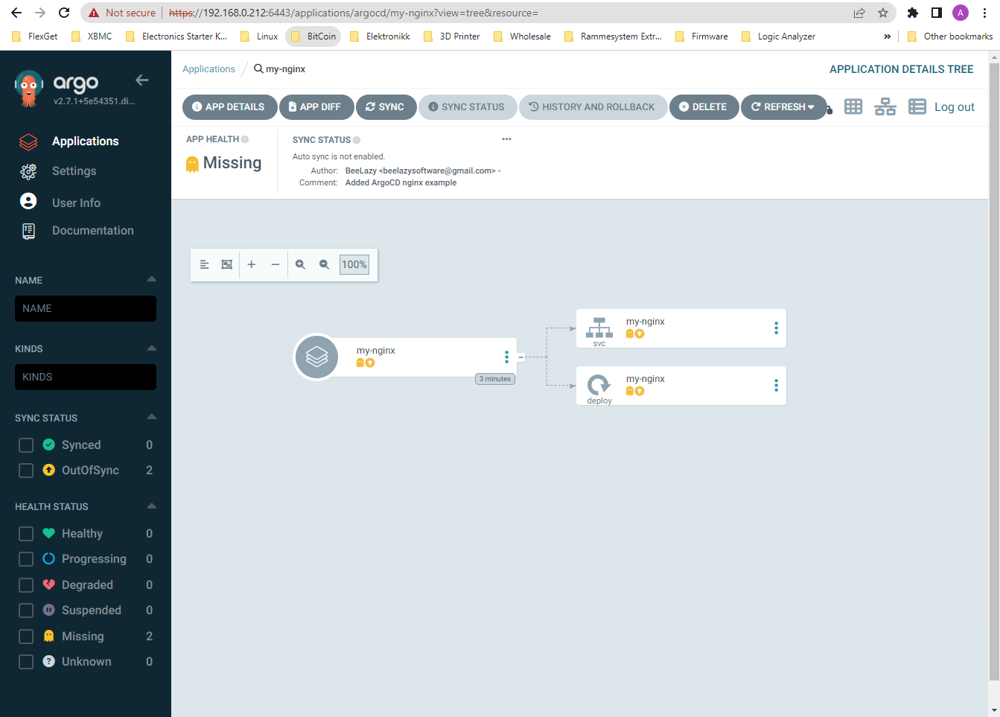
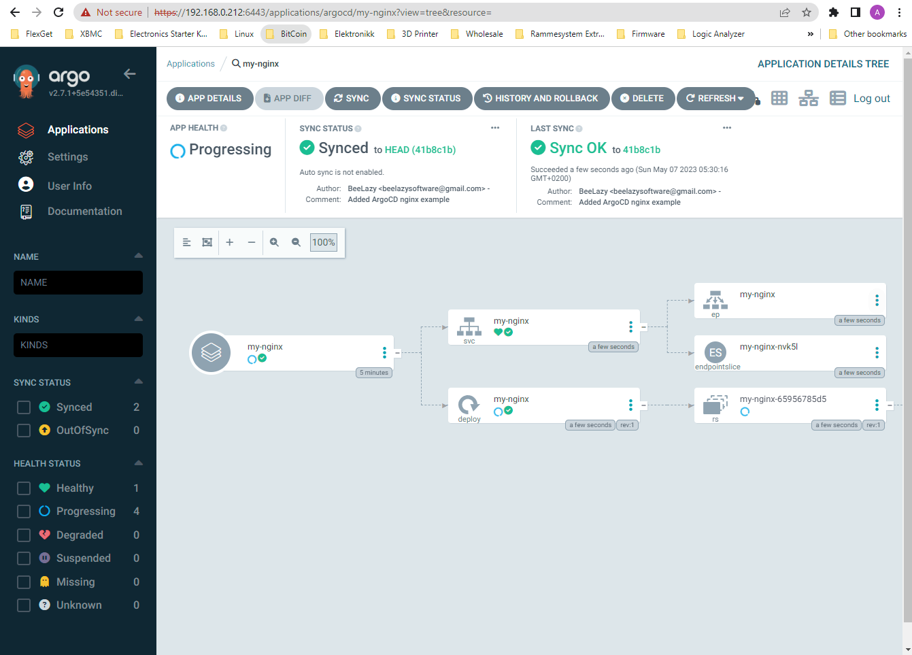
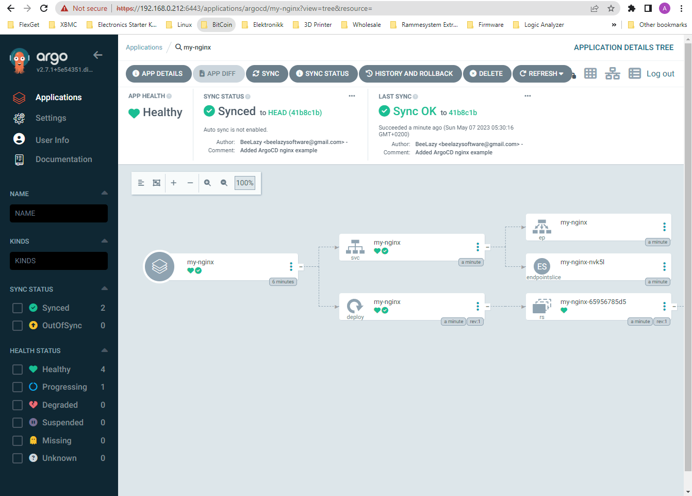

# Multipass: How-to run a Kubernetes Cloud on a Laptop

## About <a id="about"></a>
This document describes how to deploy a full Kubernetes Cloud to your laptop with **Juju**. 

## Description <a id="description"></a>
First we will deploy **ArgoCD** on **MicroK8s**, and after tearing that down we will deploy **Charmed Kubernetes** on a **LXD** cloud. 
All on a laptop.  

We will use Multipass to create a VM to run all this in, but you could use any other hypervisor if you like. You can find Multipass 
install instructions [here](Multipass-HowtoInstall.md). The important thing is that you get a Ubuntu host where we can run this. 
Like if you have KVM, you could get a VM and ssh into it like this:
```console
uvt-kvm create cdk-vm --cpu 6 --memory 10240 --disk 50
ssh ubuntu@<ip>
```

On many OSes you could skip the VM altogether, and just start with installing **Juju** and **LXD** directly on the laptop. Cleaning up after 
it is easy. Destroying the model will remove all applications and LXC containers created. That is up to you. To make this guide as general as 
possible, I will do it in a Multipass VM.  

## Table of contents <a id="table-of-contents"></a>
1. [About](#about)
2. [Description](#description)
3. [Table of contents](#table-of-contents)
5. [Create the test environment](#create-the-test-environment)
    1. [Stopping Multipass instance](#stopping-multipass-instance)
    2. [Resuming Multipass instance](#resuming-multipass-instance)
6. [Update Ubuntu host](#update-ubuntu-host)
7. [Prepare MicroK8s cloud](#prepare-microk8s-cloud)
    1. [Install Juju](#install-juju)
	2. [Register cloud with Juju](#register-cloud-with-juju)
	3. [Bootstrap controller](#bootstrap-controller)
	4. [Deploy ArgoCD](#deploy-argocd)
	5. [Connect to ArgoCD web](#connect-to-argocd-web)
	6. [Create App Via CLI](#create-app-via-cli)
	7. [Clustering MicroK8s cloud](#clustering-microk8s-cloud)
	8. [Cleanup MicroK8s cloud](#cleanup-microk8s-cloud)
8. [Prepare Charmed Kubernetes cloud](#prepare-charmed-kubernetes-cloud)
	1. [Install LXD](#install-lxd)
	2. [Install kubectl](#install-kubectl)
	3. [Install Juju](#install-juju-lxd)
	4. [Init and setup LXD](#init-and-setup-lxd)
	5. [Bootstrap it](#bootstrap-it)
	6. [Add model](#add-model)
	7. [Create overlay bundle](#create-overlay-bundle)
	8. [Edit LXC profile](#edit-lxc-profile)
	9. [Deploy Charmed Kubernetes](#deploy-charmed-kubernetes)
	10. [Cleanup Charmed Kubernetes](#cleanup-charmed-kubernetes)
9. [Related links](#related-links)

## Create the test environment <a id="create-the-test-environment"></a>
Open a terminal and use Multipass to launch an Ubuntu virtual machine and open a shell in it, as shown below. I've called mine **beecube**.
```console
bee@multipassus:~$ multipass launch -n beecube -m 10g -c 6 -d 50G jammy
Launched: beecube

bee@multipassus:~$ multipass shell beecube
Welcome to Ubuntu 22.04.2 LTS (GNU/Linux 5.15.0-71-generic x86_64)

 * Documentation:  https://help.ubuntu.com
 * Management:     https://landscape.canonical.com
 * Support:        https://ubuntu.com/advantage

  System information as of Sat May  6 20:09:34 UTC 2023

  System load:  0.1474609375      Processes:             148
  Usage of /:   3.0% of 48.27GB   Users logged in:       0
  Memory usage: 2%                IPv4 address for ens3: 10.95.75.112
  Swap usage:   0%
```

### Stopping Multipass instance <a id="stopping-multipass-instance"></a>
The recommended way of stopping an instance is:
```console
multipass stop beecube
```

### Resuming Multipass instance <a id="resuming-multipass-instance"></a>
To resume it, run:
```console
multipass start beecube
```

## Update Ubuntu host <a id="update-ubuntu-host"></a>
First we'll make sure our Ubuntu host is up to date
```console
ubuntu@beecube:~$ sudo apt-get update && sudo apt-get dist-upgrade && sudo snap refresh
2023-05-06T20:20:19Z INFO Waiting for automatic snapd restart...
snapd 2.59.2 from Canonical✓ refreshed
core20 20230404 from Canonical✓ refreshed
```

## Prepare MicroK8s cloud <a id="prepare-microk8s-cloud"></a>
Now that we have an updated Ubuntu host, we're ready to install our cloud. 
```console
# Install Microk8s from snap:
ubuntu@beecube:~$ sudo snap install microk8s --classic --channel=latest/stable
microk8s v1.27.0 from Canonical✓ installed

# Add the 'ubuntu' user to the Microk8s group:
ubuntu@beecube:~$ sudo usermod -a -G microk8s ubuntu

# Give the 'ubuntu' user permissions to read the ~/.kube directory:
ubuntu@beecube:~$ sudo chown -f -R ubuntu ~/.kube

# Create the 'microk8s' group:
ubuntu@beecube:~$ newgrp microk8s

# Enable the necessary Microk8s addons:
ubuntu@beecube:~$ microk8s enable hostpath-storage dns
Infer repository core for addon hostpath-storage
Enabling default storage class.
WARNING: Hostpath storage is not suitable for production environments.
         A hostpath volume can grow beyond the size limit set in the volume claim manifest.

deployment.apps/hostpath-provisioner created
storageclass.storage.k8s.io/microk8s-hostpath created
serviceaccount/microk8s-hostpath created
clusterrole.rbac.authorization.k8s.io/microk8s-hostpath created
clusterrolebinding.rbac.authorization.k8s.io/microk8s-hostpath created
Storage will be available soon.
```

### Install Juju <a id="install-juju"></a>
We will now install the Juju CLI client via **snap**:
```console
ubuntu@beecube:~$ sudo snap install juju --classic
juju (2.9/stable) 2.9.42 from Canonical✓ installed
```

### Register cloud with Juju <a id="register-cloud-with-juju"></a>
Registering a cloud in Juju is done by:
1. Add cloud to Juju
2. Add cloud credentials to Juju

However, Juju automatically discovers MicroK8s clouds, so we don't need to do that. You can see it if you run:
```console
ubuntu@beecube:~$ juju clouds
Only clouds with registered credentials are shown.
There are more clouds, use --all to see them.
You can bootstrap a new controller using one of these clouds...

Clouds available on the client:
Cloud      Regions  Default    Type  Credentials  Source    Description
localhost  1        localhost  lxd   0            built-in  LXD Container Hypervisor
microk8s   1        localhost  k8s   0            built-in  A Kubernetes Cluster
```

And we can see that Kubernetes is running:
```console
ubuntu@beecube:~$ microk8s.kubectl cluster-info
Kubernetes control plane is running at https://127.0.0.1:16443
CoreDNS is running at https://127.0.0.1:16443/api/v1/namespaces/kube-system/services/kube-dns:dns/proxy

To further debug and diagnose cluster problems, use 'kubectl cluster-info dump'.

ubuntu@beecube:~$ microk8s.kubectl get services
NAME         TYPE        CLUSTER-IP     EXTERNAL-IP   PORT(S)   AGE
kubernetes   ClusterIP   10.152.183.1   <none>        443/TCP   36m

ubuntu@beecube:~$ microk8s.kubectl get nodes
NAME      STATUS   ROLES    AGE   VERSION
beecube   Ready    <none>   36m   v1.27.0
```

### Bootstrap controller <a id="bootstrap-controller"></a>
This is all great. But an empty cloud can't be used for much. We will deploy **ArgoCD** to help us with that. 
But first we need to bootstrap a controller. I will name mine **hive-controller**.
```console
ubuntu@beecube:~$ juju bootstrap microk8s hive-controller
Creating Juju controller "hive-controller" on microk8s/localhost
Bootstrap to Kubernetes cluster identified as microk8s/localhost
Fetching Juju Dashboard 0.8.1
Creating k8s resources for controller "controller-hive-controller"
Starting controller pod
Bootstrap agent now started
Contacting Juju controller at 10.152.183.148 to verify accessibility...

Bootstrap complete, controller "hive-controller" is now available in namespace "controller-hive-controller"

Now you can run
        juju add-model <model-name>
to create a new model to deploy k8s workloads.
```

### Deploy ArgoCD <a id="deploy-argocd"></a>
Create a namespace for argo, and deploy the non-HS version from the [releasepage on github](https://github.com/argoproj/argo-cd/releases):
```console
ubuntu@beecube:~$ microk8s.kubectl create namespace argocd
namespace/argocd created

ubuntu@beecube:~$ microk8s.kubectl apply -n argocd -f https://raw.githubusercontent.com/argoproj/argo-cd/v2.7.1/manifests/install.yaml
customresourcedefinition.apiextensions.k8s.io/applications.argoproj.io created
customresourcedefinition.apiextensions.k8s.io/applicationsets.argoproj.io created
customresourcedefinition.apiextensions.k8s.io/appprojects.argoproj.io created
serviceaccount/argocd-application-controller created
serviceaccount/argocd-applicationset-controller created
serviceaccount/argocd-dex-server created
serviceaccount/argocd-notifications-controller created
serviceaccount/argocd-redis created
serviceaccount/argocd-repo-server created
serviceaccount/argocd-server created
role.rbac.authorization.k8s.io/argocd-application-controller created
role.rbac.authorization.k8s.io/argocd-applicationset-controller created
role.rbac.authorization.k8s.io/argocd-dex-server created
role.rbac.authorization.k8s.io/argocd-notifications-controller created
role.rbac.authorization.k8s.io/argocd-server created
clusterrole.rbac.authorization.k8s.io/argocd-application-controller created
clusterrole.rbac.authorization.k8s.io/argocd-server created
rolebinding.rbac.authorization.k8s.io/argocd-application-controller created
rolebinding.rbac.authorization.k8s.io/argocd-applicationset-controller created
rolebinding.rbac.authorization.k8s.io/argocd-dex-server created
rolebinding.rbac.authorization.k8s.io/argocd-notifications-controller created
rolebinding.rbac.authorization.k8s.io/argocd-redis created
rolebinding.rbac.authorization.k8s.io/argocd-server created
clusterrolebinding.rbac.authorization.k8s.io/argocd-application-controller created
clusterrolebinding.rbac.authorization.k8s.io/argocd-server created
configmap/argocd-cm created
configmap/argocd-cmd-params-cm created
configmap/argocd-gpg-keys-cm created
configmap/argocd-notifications-cm created
configmap/argocd-rbac-cm created
configmap/argocd-ssh-known-hosts-cm created
configmap/argocd-tls-certs-cm created
secret/argocd-notifications-secret created
secret/argocd-secret created
service/argocd-applicationset-controller created
service/argocd-dex-server created
service/argocd-metrics created
service/argocd-notifications-controller-metrics created
service/argocd-redis created
service/argocd-repo-server created
service/argocd-server created
service/argocd-server-metrics created
deployment.apps/argocd-applicationset-controller created
deployment.apps/argocd-dex-server created
deployment.apps/argocd-notifications-controller created
deployment.apps/argocd-redis created
deployment.apps/argocd-repo-server created
deployment.apps/argocd-server created
statefulset.apps/argocd-application-controller created
networkpolicy.networking.k8s.io/argocd-application-controller-network-policy created
networkpolicy.networking.k8s.io/argocd-applicationset-controller-network-policy created
networkpolicy.networking.k8s.io/argocd-dex-server-network-policy created
networkpolicy.networking.k8s.io/argocd-notifications-controller-network-policy created
networkpolicy.networking.k8s.io/argocd-redis-network-policy created
networkpolicy.networking.k8s.io/argocd-repo-server-network-policy created
networkpolicy.networking.k8s.io/argocd-server-network-policy created
```

We should now have ArgoCD:
```console
ubuntu@beecube:~$ microk8s.kubectl get all -n argocd
NAME                                                    READY   STATUS    RESTARTS   AGE
pod/argocd-applicationset-controller-6bf657d56d-vvh84   1/1     Running   0          2m26s
pod/argocd-notifications-controller-5d49c977f5-z6rnm    1/1     Running   0          2m26s
pod/argocd-redis-77bf5b886-xtjzq                        1/1     Running   0          2m26s
pod/argocd-dex-server-5778f5b7b4-8jxkl                  1/1     Running   0          2m26s
pod/argocd-server-f84cf8b46-7gcsq                       1/1     Running   0          2m25s
pod/argocd-application-controller-0                     1/1     Running   0          2m25s
pod/argocd-repo-server-7bd9b7df75-vx8km                 1/1     Running   0          2m25s

NAME                                              TYPE        CLUSTER-IP       EXTERNAL-IP   PORT(S)                      AGE
service/argocd-applicationset-controller          ClusterIP   10.152.183.95    <none>        7000/TCP,8080/TCP            2m26s
service/argocd-dex-server                         ClusterIP   10.152.183.225   <none>        5556/TCP,5557/TCP,5558/TCP   2m26s
service/argocd-metrics                            ClusterIP   10.152.183.237   <none>        8082/TCP                     2m26s
service/argocd-notifications-controller-metrics   ClusterIP   10.152.183.41    <none>        9001/TCP                     2m26s
service/argocd-redis                              ClusterIP   10.152.183.68    <none>        6379/TCP                     2m26s
service/argocd-repo-server                        ClusterIP   10.152.183.81    <none>        8081/TCP,8084/TCP            2m26s
service/argocd-server                             ClusterIP   10.152.183.184   <none>        80/TCP,443/TCP               2m26s
service/argocd-server-metrics                     ClusterIP   10.152.183.75    <none>        8083/TCP                     2m26s

NAME                                               READY   UP-TO-DATE   AVAILABLE   AGE
deployment.apps/argocd-applicationset-controller   1/1     1            1           2m26s
deployment.apps/argocd-notifications-controller    1/1     1            1           2m26s
deployment.apps/argocd-redis                       1/1     1            1           2m26s
deployment.apps/argocd-dex-server                  1/1     1            1           2m26s
deployment.apps/argocd-server                      1/1     1            1           2m26s
deployment.apps/argocd-repo-server                 1/1     1            1           2m26s

NAME                                                          DESIRED   CURRENT   READY   AGE
replicaset.apps/argocd-applicationset-controller-6bf657d56d   1         1         1       2m26s
replicaset.apps/argocd-notifications-controller-5d49c977f5    1         1         1       2m26s
replicaset.apps/argocd-redis-77bf5b886                        1         1         1       2m26s
replicaset.apps/argocd-dex-server-5778f5b7b4                  1         1         1       2m26s
replicaset.apps/argocd-server-f84cf8b46                       1         1         1       2m25s
replicaset.apps/argocd-repo-server-7bd9b7df75                 1         1         1       2m26s

NAME                                             READY   AGE
statefulset.apps/argocd-application-controller   1/1     2m25s
```

### Connect to ArgoCD web <a id="connect-to-argocd-web"></a>
Now that Argo is up and running. We're going to need the admin password. Get that with:
```console
ubuntu@beecube:~$ microk8s.kubectl -n argocd get secret argocd-initial-admin-secret -o jsonpath="{.data.password}" | base64 -d
YH8eF6aSkvfVYJRs
```

Argo is currently only available on the Kubernetes cluster network. To be able to connect to it, we will have to make the port available outside Kubernetes. 
This is normally done with a proxy like **Ingress** or setting the service type to **LoadBalancer**. For this quick test, we will only forward the port temporarily 
with **kubectl port-forward**:
```console
microk8s.kubectl port-forward --address 0.0.0.0 svc/argocd-server -n argocd 6443:443
```

This should make the **argocd-server** service availiable to the Multipass host on port 6443. **However** we want it accessible from our physical host, and the 
rest of our network too. So we'll will have to route traffic on this port from the Multipass host (the laptop) to the Multipass VM (it's inside that we're running 
our Kubernetes cluster). On the Multipass host, start with finding the IP of the Multipass VM:
```console
bee@multipassus:~$ multipass info beecube
Name:           beecube
State:          Running
IPv4:           10.95.75.112
                10.1.222.0
Release:        Ubuntu 22.04.2 LTS
Image hash:     9bbe9364e298 (Ubuntu 22.04 LTS)
CPU(s):         6
Load:           0.30 0.46 0.59
Disk usage:     6.1GiB out of 48.3GiB
Memory usage:   1.4GiB out of 9.7GiB
Mounts:         --
```

And setup the routing on the network interface **eth0** to IP **10.95.75.112** and port **6443**:
```console
bee@multipassus:~$ sudo iptables -t nat -I PREROUTING 1 -i eth0 -p tcp --dport 6443 -j DNAT --to-destination 10.95.75.112:6443
bee@multipassus:~$ sudo iptables -I FORWARD 1 -p tcp -d 10.95.75.112 --dport 6443 -j ACCEPT
```

We should now have everything we need to connect to ArgoCD at https://IPofMultipassHost:6443

Then use a browser to connect to the site: 



The username is **admin** and we found the password a bit earlier with **kubectl get secret** 


### Create App Via CLI <a id="create-app-via-cli"></a>
Beautifull. But very empty.... let's deploy something to our cloud. First we need to set the current namespace to **argocd** by running the following command:
```console
ubuntu@beecube:~$ microk8s.kubectl config set-context --current --namespace=argocd
```

We now need to create an application so Argo has something to keep track of. We could have done that in the webinterface, but let's download the CLI and use 
that to create an example nginx application with the following commands:
```console
# Get argocd command
ubuntu@beecube:~$ sudo curl -sSL -o argocd-linux-amd64 https://github.com/argoproj/argo-cd/releases/latest/download/argocd-linux-amd64
ubuntu@beecube:~$ sudo install -m 555 argocd-linux-amd64 /usr/local/bin/argocd
ubuntu@beecube:~$ rm argocd-linux-amd64

# Get password for admin, and use that to login argocd
ubuntu@beecube:~$ microk8s.kubectl -n argocd get secret argocd-initial-admin-secret -o jsonpath="{.data.password}" | base64 -d; echo
YH8eF6aSkvfVYJRs
ubuntu@beecube:~$ argocd login localhost:6443
WARNING: server certificate had error: x509: certificate signed by unknown authority. Proceed insecurely (y/n)? y
Username: admin
Password:
'admin:login' logged in successfully
Context 'localhost:6443' updated

# Create application with argocd CLI
ubuntu@beecube:~$ argocd app create my-nginx --repo https://github.com/BeeLazy/Cookbook.git --path k8s/examples/argocd-nginx --dest-server https://kubernetes.default.svc --dest-namespace default
application 'my-nginx' created
```

Checking out the Argo Dashboard now: 





We now have our nginx server, but YIKES, it's out of sync. That's because no automatic syncing is configured. 
Press the **Sync** button to sync it with the git repository.  





### Clustering MicroK8s cloud <a id="clustering-microk8s-cloud"></a>
We could have continued building on this, by adding more nodes with Multipass. Then installing MicroK8s on them and making a HA cluster. 
You can see how to do that in [this guide](MicroK8s-HowtoSetupMultinodeHighAvailabilityCluster.md).  

We will stop with MicroK8s here, tear it all down, and instead make a **Charmed Kubernetes** HA cluster on top of LXD. 

### Cleanup MicroK8s cloud <a id="cleanup-microk8s-cloud"></a>
First we need to list and remove resources made in this MicroK8s demo. On the Multipass host remove the Multipass VM:
```console
bee@multipassus:~$ multipass list
Name                    State             IPv4             Image
beecube                 Running           10.95.75.112     Ubuntu 22.04 LTS
                                          10.1.222.0
bee@multipassus:~$ multipass delete --all
bee@multipassus:~$ multipass purge
bee@multipassus:~$ multipass list
No instances found.
```

Then remove the temporary routing we made to access Argo from outside the host:
```console
bee@multipassus:~$ sudo iptables -L -n -t nat --line-number
# Warning: iptables-legacy tables present, use iptables-legacy to see them
Chain PREROUTING (policy ACCEPT)
num  target     prot opt source               destination
1    DNAT       tcp  --  0.0.0.0/0            0.0.0.0/0            tcp dpt:6443 to:10.95.75.112:6443

Chain INPUT (policy ACCEPT)
num  target     prot opt source               destination

Chain OUTPUT (policy ACCEPT)
num  target     prot opt source               destination

Chain POSTROUTING (policy ACCEPT)
num  target     prot opt source               destination
1    MASQUERADE  all  --  10.95.75.0/24       !10.95.75.0/24        /* generated for Multipass network mpqemubr0 */
2    MASQUERADE  udp  --  10.95.75.0/24       !10.95.75.0/24        /* generated for Multipass network mpqemubr0 */ masq ports: 1024-65535
3    MASQUERADE  tcp  --  10.95.75.0/24       !10.95.75.0/24        /* generated for Multipass network mpqemubr0 */ masq ports: 1024-65535
4    RETURN     all  --  10.95.75.0/24        255.255.255.255      /* generated for Multipass network mpqemubr0 */
5    RETURN     all  --  10.95.75.0/24        224.0.0.0/24         /* generated for Multipass network mpqemubr0 */
bee@multipassus:~$ sudo iptables -t nat -D PREROUTING 1

bee@multipassus:~$ sudo iptables -L --line-number
# Warning: iptables-legacy tables present, use iptables-legacy to see them
Chain INPUT (policy ACCEPT)
num  target     prot opt source               destination
1    ACCEPT     tcp  --  anywhere             anywhere             tcp dpt:domain /* generated for Multipass network mpqemubr0 */
2    ACCEPT     udp  --  anywhere             anywhere             udp dpt:domain /* generated for Multipass network mpqemubr0 */
3    ACCEPT     udp  --  anywhere             anywhere             udp dpt:bootps /* generated for Multipass network mpqemubr0 */

Chain FORWARD (policy ACCEPT)
num  target     prot opt source               destination
1    ACCEPT     tcp  --  anywhere             10.95.75.112         tcp dpt:6443
2    ACCEPT     all  --  anywhere             anywhere             /* generated for Multipass network mpqemubr0 */
3    ACCEPT     all  --  10.95.75.0/24        anywhere             /* generated for Multipass network mpqemubr0 */
4    ACCEPT     all  --  anywhere             10.95.75.0/24        ctstate RELATED,ESTABLISHED /* generated for Multipass network mpqemubr0 */
5    REJECT     all  --  anywhere             anywhere             /* generated for Multipass network mpqemubr0 */ reject-with icmp-port-unreachable
6    REJECT     all  --  anywhere             anywhere             /* generated for Multipass network mpqemubr0 */ reject-with icmp-port-unreachable

Chain OUTPUT (policy ACCEPT)
num  target     prot opt source               destination
1    ACCEPT     tcp  --  anywhere             anywhere             tcp spt:domain /* generated for Multipass network mpqemubr0 */
2    ACCEPT     udp  --  anywhere             anywhere             udp spt:domain /* generated for Multipass network mpqemubr0 */
3    ACCEPT     udp  --  anywhere             anywhere             udp spt:bootps /* generated for Multipass network mpqemubr0 */
bee@multipassus:~$ sudo iptables -D FORWARD 1
```

## Prepare Charmed Kubernetes cloud <a id="prepare-charmed-kubernetes-cloud"></a>
Now that we're basically back where we started. It's ready to install Charmed Kubernetes on LXD.  

Start with making a Multipass VM and updating it:
```console
bee@multipassus:~$ multipass launch -n beecube -m 10g -c 6 -d 50G jammy
Launched: beecube

bee@multipassus:~$ multipass shell beecube
Welcome to Ubuntu 22.04.2 LTS (GNU/Linux 5.15.0-71-generic x86_64)

ubuntu@beecube:~$ sudo apt-get update && sudo apt-get dist-upgrade && sudo snap refresh
2023-05-07T04:50:45Z INFO Waiting for automatic snapd restart...
core20 20230404 from Canonical✓ refreshed
snapd 2.59.2 from Canonical✓ refreshed
```

### Install LXD <a id="install-lxd"></a>
LXD can be installed via snap.  
If you dont have snap command, see [Installing snapd](https://snapcraft.io/docs/installing-snapd)  

LXD is pre-installed on Ubuntu Server. We will update the LXD to the latest stable release:
```console
ubuntu@beecube:~$ sudo snap remove --purge lxd && sudo snap install lxd
lxd removed
lxd 5.13-cea5ee2 from Canonical✓ installed
```

On other systems, the lxd package can be installed using:
```console
sudo snap install lxd
```

For the LXD 5.0 LTS release, use:
```console
sudo snap install lxd --channel=5.0/stable
```

### Install kubectl <a id="install-kubectl"></a>
```console
sudo snap install kubectl --classic
```

### Install Juju <a id="install-juju-lxd"></a>
We will now install the Juju CLI client via **snap**:
```console
ubuntu@beecube:~$ sudo snap install juju --classic
juju (2.9/stable) 2.9.42 from Canonical✓ installed
```

### Init and setup LXD <a id="init-and-setup-lxd"></a>
```console
ubuntu@beecube:~$ sudo lxd init
Would you like to use LXD clustering? (yes/no) [default=no]:
Do you want to configure a new storage pool? (yes/no) [default=yes]:
Name of the new storage pool [default=default]:
Name of the storage backend to use (dir, lvm, zfs, btrfs, ceph) [default=zfs]: dir
Would you like to connect to a MAAS server? (yes/no) [default=no]:
Would you like to create a new local network bridge? (yes/no) [default=yes]:
What should the new bridge be called? [default=lxdbr0]:
What IPv4 address should be used? (CIDR subnet notation, “auto” or “none”) [default=auto]:
What IPv6 address should be used? (CIDR subnet notation, “auto” or “none”) [default=auto]: none
Would you like the LXD server to be available over the network? (yes/no) [default=no]:
Would you like stale cached images to be updated automatically? (yes/no) [default=yes]:
Would you like a YAML "lxd init" preseed to be printed? (yes/no) [default=no]:
```

### Bootstrap it <a id="bootstrap-it"></a>
```console
ubuntu@beecube:~$ juju bootstrap localhost
Creating Juju controller "localhost-localhost" on localhost/localhost
Looking for packaged Juju agent version 2.9.42 for amd64
Located Juju agent version 2.9.42-ubuntu-amd64 at https://streams.canonical.com/juju/tools/agent/2.9.42/juju-2.9.42-linux-amd64.tgz
To configure your system to better support LXD containers, please see: https://linuxcontainers.org/lxd/docs/master/explanation/performance_tuning/
Launching controller instance(s) on localhost/localhost...
 - juju-3f558b-0 (arch=amd64)
Installing Juju agent on bootstrap instance
Fetching Juju Dashboard 0.8.1
Waiting for address
Attempting to connect to 10.9.71.106:22
Connected to 10.9.71.106
Running machine configuration script...
Bootstrap agent now started
Contacting Juju controller at 10.9.71.106 to verify accessibility...

Bootstrap complete, controller "localhost-localhost" is now available
Controller machines are in the "controller" model
Initial model "default" added
```

### Add model <a id="add-model"></a>
Adding a model helps keep things clean and organized
```console
ubuntu@beecube:~$ juju add-model cdk-127
Added 'cdk-127' model on localhost/localhost with credential 'localhost' for user 'admin'
```

### Create overlay bundle <a id="create-overlay-bundle"></a>
```console
# Source: https://raw.githubusercontent.com/charmed-kubernetes/bundle/main/fragments/k8s/cdk/bundle.yaml
cat << EOF > bundle.yaml
description: A highly-available, production-grade Kubernetes cluster.
series: jammy
applications:
  "kubernetes-control-plane":
    constraints: "cores=1 mem=3G root-disk=16G"
  "kubernetes-worker":
    constraints: "cores=2 mem=6G root-disk=16G"
    num_units: 2
  "etcd":
    constraints: "cores=1 mem=4G root-disk=16G"
EOF
```

### Edit LXC profile <a id="edit-lxc-profile"></a>
```console
lxc profile edit juju-cdk-127
```

Replace it with:
```console
config:
  boot.autostart: "true"
  linux.kernel_modules: ip_tables,ip6_tables,netlink_diag,nf_nat,overlay
  raw.lxc: |
    lxc.apparmor.profile=unconfined
    lxc.mount.auto=proc:rw sys:rw cgroup:rw
    lxc.cgroup.devices.allow=a
    lxc.cap.drop=
  security.nesting: "true"
  security.privileged: "true"
description: ""
devices:
  aadisable:
    path: /sys/module/nf_conntrack/parameters/hashsize
    source: /dev/null
    type: disk
  aadisable1:
    path: /sys/module/apparmor/parameters/enabled
    source: /dev/null
    type: disk
name: juju-cdk-127
used_by: []
```

### Deploy Charmed Kubernetes <a id="deploy-charmed-kubernetes"></a>
```console
ubuntu@beecube:~$ juju deploy charmed-kubernetes --overlay bundle.yaml
Located bundle "charmed-kubernetes" in charm-hub, revision 1217
Located charm "calico" in charm-hub, channel stable
Located charm "containerd" in charm-hub, channel stable
<snipp>
- add unit kubernetes-worker/2 to new machine 9
Deploy of bundle completed.
```

This will take a while depending on hardware resources allocated. You can check status with **juju status**:
```console
ubuntu@beecube:~$ juju status
Model    Controller           Cloud/Region         Version  SLA          Timestamp
cdk-127  localhost-localhost  localhost/localhost  2.9.42   unsupported  05:54:28Z

App                       Version  Status   Scale  Charm                     Channel  Rev  Exposed  Message
calico                             unknown      0  calico                    stable    82  no
containerd                         unknown      0  containerd                stable    58  no
easyrsa                            waiting    0/1  easyrsa                   stable    39  no       waiting for machine
etcd                               waiting    0/3  etcd                      stable   736  no       waiting for machine
kubeapi-load-balancer              waiting    0/1  kubeapi-load-balancer     stable    66  yes      waiting for machine
kubernetes-control-plane           waiting    0/2  kubernetes-control-plane  stable   260  no       waiting for machine
kubernetes-worker                  waiting    0/3  kubernetes-worker         stable   106  yes      waiting for machine

Unit                        Workload  Agent       Machine  Public address  Ports  Message
easyrsa/0                   waiting   allocating  0        10.9.71.55             waiting for machine
etcd/0                      waiting   allocating  1                               waiting for machine
etcd/1                      waiting   allocating  2                               waiting for machine
etcd/2                      waiting   allocating  3                               waiting for machine
kubeapi-load-balancer/0     waiting   allocating  4                               waiting for machine
kubernetes-control-plane/0  waiting   allocating  5                               waiting for machine
kubernetes-control-plane/1  waiting   allocating  6                               waiting for machine
kubernetes-worker/0         waiting   allocating  7                               waiting for machine
kubernetes-worker/1         waiting   allocating  8                               waiting for machine
kubernetes-worker/2         waiting   allocating  9                               waiting for machine

Machine  State    Address     Inst id        Series  AZ  Message
0        pending  10.9.71.55  juju-5b60db-0  jammy       Running
1        down                 pending        jammy       Creating container
2        down                 pending        jammy       Creating container
3        down                 pending        jammy       Creating container
4        down                 pending        jammy       Creating container
5        down                 pending        jammy       Creating container
6        down                 pending        jammy       Creating container
7        down                 pending        jammy       Creating container
8        down                 pending        jammy       Creating container
9        down                 pending        jammy       Creating container
```

Yeah, it's going to take a while:
```console
top - 06:08:40 up 15:29,  3 users,  load average: 3.05, 2.08, 1.79
Tasks: 168 total,   1 running, 167 sleeping,   0 stopped,   0 zombie
%Cpu(s): 74.1 us,  1.4 sy,  0.0 ni, 23.5 id,  1.0 wa,  0.0 hi,  0.0 si,  0.0 st
MiB Mem :  16000.6 total,    150.3 free,  10502.7 used,   5347.6 buff/cache
MiB Swap:   4096.0 total,   3838.8 free,    257.2 used.   5160.1 avail Mem

    PID USER      PR  NI    VIRT    RES    SHR S  %CPU  %MEM     TIME+ COMMAND
  20159 root      20   0   14.5g   9.9g   8684 S 603.0  63.4  64:41.35 qemu-system-x86
    381 root      20   0       0      0      0 S   0.3   0.0   0:22.46 jbd2/dm-0-8
  20416 bee       20   0   10488   3812   3212 R   0.3   0.0   0:00.79 top
      1 root      20   0  167772  11436   6580 S   0.0   0.1   0:13.37 systemd
```

Let's hope this ends better than when we tested if it could run Crysis:


Now you (should) have a good **Kubernetes Cluster**, a **LXD cloud** and **Multipass** to play with. Happy labbing.  

### Cleanup Charmed Kubernetes <a id="cleanup-charmed-kubernetes"></a>
If you want to make a new lab, there is no need to tear down the entire Multipass VM like we did with MicroK8s. 
Destroying the model is enough to remove all applications and LXC containers created:
```console
juju destroy-model cdk-127
```

## Related links <a id="related-links"></a>
[Getting started with Juju - juju.is](https://juju.is/docs/olm/get-started-with-juju)  
[Charmed Juju - askubuntu.com](https://askubuntu.com/questions/1147622/juju-charmed-kubernetes-what-are-minimal-hardware-requirements)  
[Installing snapd - snapcraft.io](https://snapcraft.io/docs/installing-snapd)  
